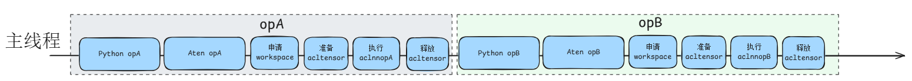
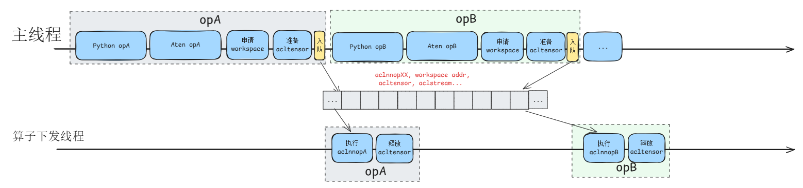
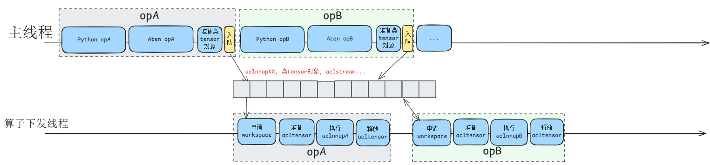

# TaskQueue并行下发

## 简介

在模型规模较大、算子调用密集的场景下（如Transformer类大模型推理/训练），Host端算子下发耗时显著，导致NPU设备利用率下降。TaskQueue是TorchNPU为加速算子下发而设计的软件机制，通过将算子下发流程拆分为主线程与算子下发线程，利用队列进行数据传递，实现算子准备工作与aclnn Host API调用并行执行，从而抵消部分下发耗时并降低CPU指令缓存缺失率。在实际业务场景中，开启TaskQueue均可带来性能提升（典型场景下发延迟降低5%-20%）。采用[场景三算子异步下发流程](#场景三算子异步下发流程task_queue_enable2)可进一步提升下发性能，但需关注独立内存池导致的峰值内存上涨。

默认情况下，同一设备内所有线程和Stream共享一个队列；不同设备或不同进程的队列相互独立。TaskQueue主要适用以下情况：

- **训练/推理时**：Host端算子下发对耗时敏感，需抵消aclnn host API调用耗时。
- **算子密集时**：模型中算子数量大、单算子耗时短（如大模型逐element-wise算子），Host端易成为性能瓶颈。
- **缓存优化时**：需要降低CPU指令缓存缺失率带来的性能损耗。

## 使用场景

### 场景一：算子串行下发流程（TASK_QUEUE_ENABLE=0）



该场景下，算子下发流程通过PyTorch函数式调用逐层执行并返回，所有调用均在一个线程内完成，行为与GPU类似。该线程通常为：

- **推理应用**：Python业务进程的主线程，或用户手动创建的Python线程。
- **训练应用**：正向阶段为Python业务进程的主线程，反向阶段为PyTorch内部创建的反向线程。

### 场景二：算子异步下发流程（TASK_QUEUE_ENABLE=1，默认）



该场景下，将部分负载（主要是aclnn的Host API调用，含runtime kernel的实际launch）迁移至算子下发线程。通过队列在两个线程间传递数据，以流水线方式减少等待时间，提升执行效率。

> [!NOTE]
> 
> workspace内存的申请仍在主线程，使用当前流的内存池，与算子输入/输出内存池相同。

### 场景三：算子异步下发流程（TASK_QUEUE_ENABLE=2）



在场景二的基础上，将workspace内存的计算与申请下放至算子下发线程。

由于算子输入/输出内存在主线程申请，而workspace内存在算子下发线程申请，若共用同一内存池，workspace可能错误复用同一算子的输入或已释放内存，导致内存冲突。因此该模式需采用独立的workspace内存池设计，非TorchNPU内置的自定义算子不应使用此模式。

## 使用指导

通过设置`TASK_QUEUE_ENABLE`环境变量可配置是否开启TaskQueue以及是否进一步提升性能。

- 配置为“0”时，关闭task_queue算子下发队列优化。
- 配置为“1”时，相比关闭（`TASK_QUEUE_ENABLE=0`），几乎所有实际业务场景均可获得性能提升。该设置默认对所有内置算子生效。
- 配置为“2”时，相比配置为“1”可进一步提升性能，由于采用独立的内存池设计，若部分算子使用较大workspace内存，配置为“2”相比“1”可能出现峰值内存上涨的情况。建议仅在模型稳定训练后、剩余内存充裕的场景下尝试。

> [!NOTE]
> 
> - 此环境变量默认设置为“1”。
> - 当配置为“1”或“2”时，非内置算子则需参考[自定义算子接入TaskQueue](taskqueue_op_developer.md)完成适配，适配后同样受`TASK_QUEUE_ENABLE`控制。
> - 问题排查请参见[常见问题排查](faq.md#常见问题排查)。

## 使用样例

- 关闭task_queue算子下发队列优化

```shell
# 关闭TaskQueue
export TASK_QUEUE_ENABLE=0
```

- 开启task_queue算子下发队列优化

```shell
# 开启TaskQueue
export TASK_QUEUE_ENABLE=1
```

- 开启task_queue机制，进一步优化算子下发流程

```shell
# 开启TaskQueue，进一步优化算子下发流程
export TASK_QUEUE_ENABLE=2
```

## 约束说明

环境变量配置为“2”时与NPUGraph（aclgraph）不兼容，无法同时开启。
