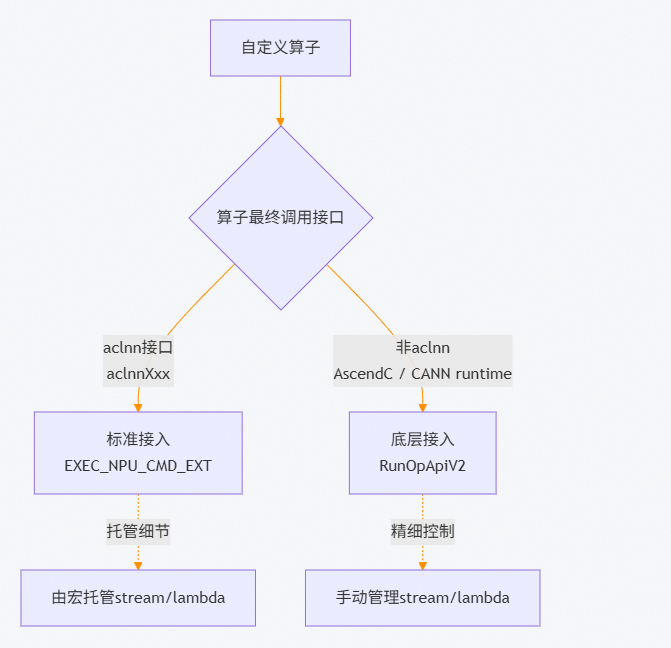

# 自定义算子接入TaskQueue

## 概述

C++算子开发人员需要遵循指引完成自定义算子接入TaskQueue流水线的适配，确保自定义算子在启用TaskQueue时能够正确入队并获取性能提升。适配完成后，模型开发人员可通过 `TASK_QUEUE_ENABLE` 控制算子行为，其使用方式与内置算子保持一致。

在 [Host级TaskQueue流水线并行下发](host_taskqueue_parallel_delivery.md) 介绍 `TASK_QUEUE_ENABLE` 控制机制的基础上，提供自定义算子接入TaskQueue的两条路径：标准接入（基于`EXEC_NPU_CMD_EXT`，仅适用于aclnn）与底层接入（基于`RunOpApiV2`，使用于AscendC kernel或非aclnn CANN接口），并详细说明流获取、lambda捕获、应用示例及常见问题排查方法。

## 接入路径选择

自定义算子根据其最终调用的接口分为两条接入路径：

| 接入路径 | 适用场景 | 关键差异 |
|---------|---------|---------|
| [标准接入：EXEC_NPU_CMD_EXT](#标准接入exec_npu_cmd_ext仅适配aclnn) | 算子最终调用aclnn接口 | 宏自动托管stream与lambda捕获，适配最简 |
| [底层接入：RunOpApiV2](#底层接入runopapiv2) | AscendC kernel launch / 非aclnn CANN接口 | 需手动管理stream、lambda生命周期，性能更可控 |



### 标准接入：EXEC_NPU_CMD_EXT（仅适配aclnn）

`EXEC_NPU_CMD_EXT` 是torch_npu提供的宏，专为aclnn系列算子适配TaskQueue流水线而设计。宏内部已自动处理stream获取、lambda捕获、参数转换等TaskQueue适配细节，开发者仅需按正确签名传入算子名称与参数即可。

#### 实现机制

`EXEC_NPU_CMD_EXT` 的工作流程分为四步：

1. **获取stream**：宏内部调用 `c10_npu::getCurrentNPUStream().stream(false)` 获取 `aclrtStream`，不触发TaskQueue清空。该过程由宏托管，开发者无需手动调用。
2. **封装lambda**：宏将算子调用与参数包成一个 `PROC_FUNC`（`std::function<int()>`），按值捕获所需变量。
3. **入队执行**：通过 `OpCommand::RunOpApiV2` 提交到TaskQueue队列，由算子下发线程调用lambda完成Host API调用。
4. **回收管理**：宏内部负责捕获变量的生命周期管理，开发者无需关注。

> [!NOTE]
>
> - 禁止手动管理 `aclrtStream`。宏内部已托管stream的获取、传递与同步；若额外调用 `getCurrentNPUStream().stream(false)` 或自行管理 `aclrtStream`，可能与宏内部逻辑冲突。
> - 若仅需 `NPUStream` 对象进行查流（如比较stream id、查询流属性等），可直接调用 `c10_npu::getCurrentNPUStream()`，该调用不会触发队列清空。
> - 入参的 `at::Tensor` 由宏内部按值捕获，开发者无需在算子函数中手动延长其生命周期。

#### 应用示例

```cpp
#include <ATen/OpCommand.h>

// 一个简单的加法算子，最终调用aclnnAdd
at::Tensor custom_add(const at::Tensor &x, const at::Tensor &y)
{
    // 1. 创建输出tensor（主线程）
    at::Tensor z = at::empty_like(x);

    // 2. 使用EXEC_NPU_CMD_EXT，宏内部自动处理stream、lambda、入队EXEC_NPU_CMD_EXT(aclnnAdd, x, y, z);
    return z;
}
```

**示例说明**：

- 第一个参数 `aclnnAdd` 为待调用的aclnn算子（也可使用带命名空间前缀的 `at::native::CustomAclnnOp` 等）。
- 后续参数 `x`、`y`、`z` 为aclnn算子的输入与输出，宏内部将其按值捕获至lambda中。
- 宏依据aclnn算子参数列表自动将 `at::Tensor` 转换为 `aclTensor*`，开发者无需手动执行类型转换。

工程使用样例请参见：[适配开发及调用（基础样例）](https://gitcode.com/Ascend/op-plugin/tree/master/examples/cpp_extension_base)

### 底层接入：RunOpApiV2

本节提供底层接入路径的完整指南，适用于AscendC kernel launch等非aclnn场景。`RunOpApi` 系列包含三个版本，以下三个接口封装了算子下发至NPU Stream（异步任务队列或同步执行）的完整流程，涵盖trace、profiling、入队及同步等逻辑。

**接口签名**

| 接口 | 签名 |
|------|------|
| `RunOpApi` | `RunOpApi(const string &op_name, PROC_FUNC func, bool sync = false)` |
| `RunOpApiV2` | `RunOpApiV2(const string &op_name, const PROC_FUNC &func, bool sync = false)` |
| `RunOpApiV3` | `RunOpApiV3(const string &op_name, const PROC_FUNC &func, bool sync = false, c10_npu::NPUStream *task_stream = nullptr)` |

**公共类型与参数**

- `PROC_FUNC`：类型别名为 `std::function<int()>`，即用户传入的算子执行回调函数，返回 `int` 类型的错误码（0表示成功）。
- `op_name`：算子名称（如 `Add`），用于RECORD_FUNCTION、profiling及trace标记。若长度超过99字节，将会被截断。
- `func`：算子执行回调。V1按值传入，V2/V3以常引用传入（避免拷贝）。
- `sync`：是否在算子下发后阻塞同步当前stream，默认 `false`。
- `task_stream`：指定的目标stream指针，**仅V3支持**；用于将算子下发到非当前stream对应的队列。

**实现差异**

| 版本 | 参数结构体 | 队列类型 | op_name传递 | func传递 | 指定stream | 备注 |
|------|-----------|---------|------------|----------|------------|------|
| `RunOpApi` | `ExecuteParasOpApi` | `EXECUTE_OPAPI` | 拷贝到 `char[100]` | 按值 | 否 | 早期版本 |
| `RunOpApiV2` | `ExecuteParasOpApiV2` | `EXECUTE_OPAPI_V2` | `std::string*` 指针 | `const &`（指针引用） | 否 | 性能优化版，减少func冗余拷贝 |
| `RunOpApiV3` | `ExecuteParasOpApiV2` | `EXECUTE_OPAPI_V2` | `std::string*` 指针 | `const &`（指针引用） | 是 | 在V2上扩展支持stream粒度TaskQueue |

**使用建议**：

- 底层接入推荐使用 `RunOpApiV2`。`RunOpApiV3` 主要用于内部 `PER_STREAM_QUEUE` 试验特性。后续章节均以 `RunOpApiV2` 为例进行说明。
- 所有接口的 `op_name` 长度超过99字节后将会被截断。

#### 实现机制

`RunOpApiV2` 的简易完整用法包含三步：获取流与处理队列 → 定义lambda函数捕获 → 调用 `OpCommand::RunOpApiV2` 入队。

```cpp
at::Tensor my_custom_op(const at::Tensor &x, const at::Tensor &y)
{
    // 1. 获取aclrtStream（不清空队列）
    auto acl_stream = c10_npu::getCurrentNPUStream().stream(false);
    at::Tensor z = at::empty_like(x);

    // 2. 定义lambda：封装内核启动逻辑，值捕获所需变量auto acl_call = [=]() -> int {
        my_kernel<<<...>>>(..., acl_stream);
        return 0;
    };

    // 3. 调用RunOpApiV2入队（op_name用于trace/profiling）
    at_npu::native::OpCommand::RunOpApiV2("my_custom_op", acl_call);
    return z;
}
```

##### 流与处理队列

在自定义算子接入TaskQueue时，正确获取NPU Stream和aclrtStream是关键的一步。核心原则：

1. 获取当前NPUStream：使用c10_npu::getCurrentNPUStream() 返回NPUStream对象。
2. 获取aclrtStream：将NPUStream转换为CANN层使用的aclrtStream类型。
3. 避免隐式队列清空：直接向需要aclrtStream的接口传递NPUStream对象会触发隐式转换，该隐式转换会清空TaskQueue，破坏流水线并行效果。应显式调用 .stream(false) 来获取aclrtStream而不清空队列。

**不清空队列（推荐）**

显式调用 `stream(false)` 获取 `aclrtStream`，不触发TaskQueue清空：

```cpp
// 通过stream(false) 获取aclrtStream，不触发TaskQueue清空auto acl_stream = c10_npu::getCurrentNPUStream().stream(false);
```

**清空队列（不推荐）**

以下两种写法都会触发隐式队列清空，导致TaskQueue流水线优化失效：

- **方法一**：显式调用 `stream()` —— 等价于 `stream(true)`，会清空TaskQueue。

    ```cpp
    // 隐式转换或调用stream()（等价于stream(true)），会清空TaskQueue
    // 这会破坏TaskQueue的异步下发流水线，降低性能auto acl_stream = c10_npu::getCurrentNPUStream().stream();  // stream() 默认清队列
    ```

- **方法二**：直接将NPUStream传给需要aclrtStream的函数 —— 触发隐式类型转换，从而清空队列。

    ```cpp
    auto npu_stream = c10_npu::getCurrentNPUStream();  // 获取NPUStream，此时不触发隐式类型转换
    // 其他逻辑...
    add_custom<<<blockDim, nullptr, npu_stream>>>; // npu_stream触发隐式类型转换，清空队列
    ```

**特殊场景**

- 若不打算使用TaskQueue而要直接在stream上执行算子，务必先清空TaskQueue。
- 推荐做法：在执行stream上的操作前再通过清空队列的方式获取aclrtStream，避免提前清空队列后，后续其他入队操作与自定义的算子并行执行而引发时序错误。

    ```cpp
    // 需要直接下发到stream的场景：先清空TaskQueue
    auto acl_stream = c10_npu::getCurrentNPUStream().stream(true);  // 或直接stream()
    // 注意：确保在清空队列之后再执行操作，且清空后不应再有入队操作
    ```

##### Lambda函数捕获

TaskQueue的核心机制是将算子执行封装为lambda函数，入队到另一个线程进行执行。在自定义算子接入TaskQueue时，lambda函数的正确使用至关重要；不当使用可能导致悬空引用、内存泄漏、或对象生命周期异常延长等风险。

**基本原则**：lambda函数进入TaskQueue队列后会在另一个线程执行，其生命周期晚于主线程，应采用值捕获（[=]），避免使用引用捕获（[&]），否则容易导致悬空引用。

**捕获原则速查表**

| 数据类型 | 推荐捕获方式 | 生命周期说明 |
|---------|-------------|------------|
| 基础类型 | 值捕获 `[=]` | 拷贝到lambda闭包，生命周期安全 |
| 张量类型 | **传递裸指针**（`data_ptr`） | 不延长tensor生命周期，内存由NPU内存池保障 |
| 自定义数据 | **智能指针**（`std::shared_ptr`）值捕获 | 智能指针生命周期延长到lambda结束，自动析构 |
| 显示管理类型 | 值捕获指针，**手动释放** | 在lambda内调用 `aclDestroyTensor` 等接口 |
| 任何类型 | **避免引用捕获** `[&]` | 主线程局部变量可能已销毁 → 悬空引用 |

各类数据的具体捕获示例与代码说明请参见 [各类数据捕获方式示例](/various_data_capture_methods.md)。

#### 应用示例

底层接入问题的核心场景聚焦于lambda捕获与stream管理的协同使用。本节通过对比正确与错误两种做法，帮助读者理解关键细节。

##### 正确示例：使用stream(false) + OpCommand入队列

使用 `stream(false)` 获取 `aclrtStream` 但不清空TaskQueue，配合 `OpCommand::RunOpApiV2` 将lambda正确入队。内核启动被封装在lambda中，通过正确的入队与出队确保执行顺序，避免与之前的任务乱序执行。

```cpp
// 正确做法：使用stream(false) 配合OpCommand进行queue管理
// stream(false) 返回ACL stream但不清queue，结合OpCommand::RunOpApiV2使用，
// 内核启动被封装在lambda中，通过正确地入queue和出queue确保正确的执行顺序。
at::Tensor ascendc_add_good(const at::Tensor &x, const at::Tensor &y)
{
    auto acl_stream = c10_npu::getCurrentNPUStream().stream(false);
    at::Tensor z = at::empty_like(x);
    uint32_t blockDim = 8;
    uint32_t totalLength = 1;
    for (uint32_t size : x.sizes()) {
        totalLength *= size;
    }
    auto xGm = (uint8_t *)(x.mutable_data_ptr());
    auto yGm = (uint8_t *)(y.mutable_data_ptr());
    auto zGm = (uint8_t *)(z.mutable_data_ptr());

    // 定义内核启动lambda函数auto acl_call = [=]() -> int {
        // Launch kernel use <<<>>>
        add_custom<<<blockDim, nullptr, acl_stream>>>(xGm, yGm, zGm, totalLength);
        return 0;
    };

    // 通过OpCommand运行内核，内部会进行入queue和出queue的操作
    // 确保与stream中其他NPU操作的正确同步at_npu::native::OpCommand::RunOpApiV2("ascendc_add", acl_call);
    return z;
}
```

##### 错误示例：既不清空队列也不入队列

使用 `stream(false)` 但不使用 `OpCommand` 入队列，直接启动内核绕过了队列的串行化保证，可能导致：内核在设备上的执行顺序与Host不一致，造成数据错误等问题。

```cpp
// 错误做法：既不清queue也不入queue
// 直接启动内核绕过了队列的串行化保证，可能导致：内核在设备上的执行顺序与host不一致，造成数据错误。
at::Tensor ascendc_add_bad(const at::Tensor &x, const at::Tensor &y)
{
    auto acl_stream = c10_npu::getCurrentNPUStream().stream(false);
    at::Tensor z = at::empty_like(x);
    uint32_t blockDim = 8;
    uint32_t totalLength = 1;
    for (uint32_t size : x.sizes()) {
        totalLength *= size;
    }
    auto xGm = (uint8_t *)(x.mutable_data_ptr());
    auto yGm = (uint8_t *)(y.mutable_data_ptr());
    auto zGm = (uint8_t *)(z.mutable_data_ptr());
    // Launch kernel use <<<>>>
    add_custom<<<blockDim, nullptr, acl_stream>>>(xGm, yGm, zGm, totalLength);
    // 错误：直接启动内核，没有经过OpCommand入queue
    // TaskQueue中可能还有未下发的任务，它们依赖的stream状态可能不被新内核感知
    // 导致新内核与之前任务乱序执行，产生静默数据错误return z;
}
```

工程使用样例：[op-plugin/examples/cpp_extension](https://gitcode.com/Ascend/op-plugin/blob/master/examples/cpp_extension)
