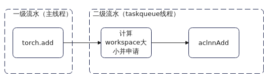

# TASK\_QUEUE\_ENABLE

## 功能描述

通过此环境变量可配置task\_queue算子下发队列是否开启和优化等级。

-   配置为“0”时：关闭task\_queue算子下发队列优化，算子下发任务如[图1](#关闭task_queue)所示。

    **图 1**  关闭task\_queue<a id="关闭task_queue"></a>    
    

-   配置为“1”或未配置时：开启task\_queue算子下发队列Level 1优化，算子下发任务如[图2](#Level-1优化)所示。

    Level 1优化：使能task\_queue算子下发队列优化，将算子下发任务分为两段，一部分任务（主要是aclnn算子的调用）放在新增的二级流水上，一、二级流水通过算子队列传递任务，相互并行，通过部分掩盖减少整体的下发耗时，提升端到端性能。

    **图 2**  Level 1优化<a id="Level-1优化"></a>     
    

-   配置为“2”时：开启task\_queue算子下发队列Level 2优化，算子下发任务如[图3](#Level-2优化)所示。

    Level 2优化：包含Level 1的优化并进一步平衡了一、二级流水的任务负载，主要是将workspace相关任务迁移至二级流水，掩盖效果更好，性能收益更大。该配置仅在二进制场景生效，建议配置值为Level 2优化。

    **图 3**  Level 2优化<a id="Level-2优化"></a>       
    

    此环境变量默认配置为“1”。

## 配置示例

```
export TASK_QUEUE_ENABLE=2
```

## 使用约束

[ASCEND\_LAUNCH\_BLOCKING](ASCEND_LAUNCH_BLOCKING.md)设置为“1”时，task\_queue算子队列关闭，TASK\_QUEUE\_ENABLE设置不生效。

TASK\_QUEUE\_ENABLE配置为“2”时，由于内存并发，可能导致运行中NPU内存峰值上升。

## 支持的型号

-   <term>Atlas 训练系列产品</term>
-   <term>Atlas A2 训练系列产品</term>
-   <term>Atlas A3 训练系列产品</term>
-   <term>Atlas 800I A2 推理产品</term>
-   <term>Atlas 推理系列产品</term>

