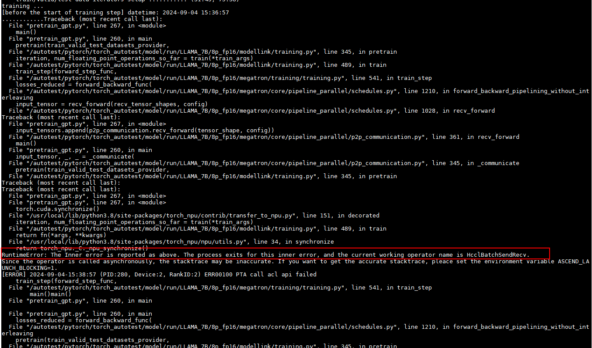

# 在进行模型分布式训练时遇到报错“RuntimeError: The Inner Error ...”

## 问题描述

配置RANK\_TABLE\_FILE的场景下，在进行模型分布式训练时遇到报错“RuntimeError: The Inner Error ...”，并且打印的operator name是具体的通信算子。



## 问题分析

原有协商建链方式中，在socket协商和协商后的建链阶段都会有对应的超时时间，为HCCL\_CONNECT\_TIMEOUT对应的时间。而在ranktable建链方式中，不存在socket协商，直接开始了建链，对应建链阶段的超时时间也为HCCL\_CONNECT\_TIMEOUT对应的时间。因此，就可能存在原流程中建链成功但ranktable建链超时的情况。

## 处理方法

可以选择修改环境变量HCCL\_CONNECT\_TIMEOUT来解决该问题。

在HCCL\_CONNECT\_TIMEOUT原有时间的基础上增加30秒。如原超时时间为120秒，可进行如下设置：

```
export HCCL_CONNECT_TIMEOUT=150
```

最后，再次运行模型。

