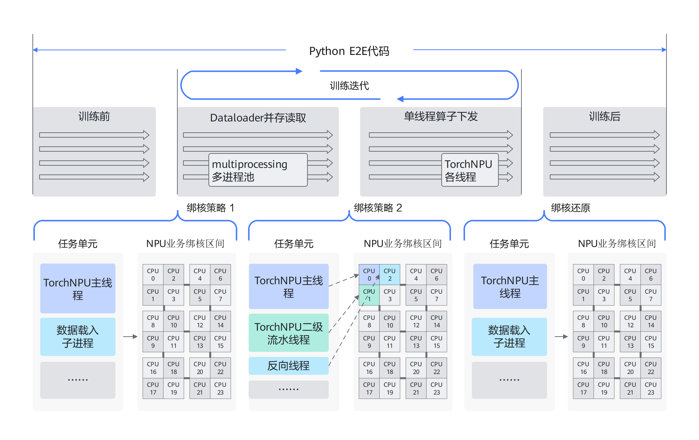

# 自动绑核

## 简介

Ascend Extension for PyTorch可以通过设置环境变量CPU\_AFFINITY\_CONF来开启粗/细粒度绑核。该配置能够避免线程间抢占，提高缓存命中，避免跨NUMA（非统一内存访问架构）节点的内存访问，减少任务调度开销，优化任务执行效率。

可选的绑核方案如下：

- **粗粒度绑核**：将所有任务绑定在NPU业务绑核区间的所有CPU核上，避免不同卡任务之间的线程抢占。
- **细粒度绑核**：在粗粒度绑核的基础上进一步优化，将torch\_npu热点线程（主线程、二级流水线程等）锚定在NPU业务绑核区间的固定CPU核上，即，主线程绑定在绑核区间的第一个CPU核上，二级流水线程绑定在绑核区间的第二个CPU核上，以此类推，非热点线程（如dataloader线程）则绑定在区间的剩余CPU核上，与热点线程隔离，减少核间切换的开销。

    > [!NOTE]  
    > NPU业务绑核区间：当开启绑核特性时，每张NPU卡业务的默认绑核区间为CPU核总数按照NPU卡总数平分后的对应区间，例如，假设环境有160个CPU核和8张NPU卡，则开启绑核时，NPU卡的0业务的绑核区间为\[0,19\]，即第一个八等分后的区间，NPU卡1的业务的绑核区间为\[20,39\]，以此类推；此外，用户也可以通过在环境变量内增加参数来指定某张卡业务的绑核区间，详情见[使用指导](#使用指导)。

**图 1**  线程绑核的时机和策略设计示意图  


## 使用场景

host下发任务慢或卡间业务耗时波动大的场景下，推荐使用该特性。

## 使用指导

环境变量CPU\_AFFINITY\_CONF=<mode\>,force:<value0\>,npu<value1\>:<value2\>-<value3\>,npu\_affine:<value4\>

1. <mode\>：必选参数，表示绑核模式。
    - 0或未设置：表示不启用绑核功能。
    - 1：表示开启粗粒度绑核。
    - 2：表示开启细粒度绑核。

2. force:<value0\>：可选参数，表示是否强制绑核，跳过冲突检测。
    - 不配置该参数（默认）或配置为0：保持原有行为，当配置的绑核范围与进程当前CPU亲和性存在冲突时，跳过绑核并输出WARNING日志。
    - 1：跳过冲突检测，强制应用绑核配置。适用于容器核隔离等场景，例如通过Cgroup（Control Groups，控制组）限制可用核，避免因Cgroup对可用CPU核数的限制引发冲突检测误判，导致绑核配置失效。

    > [!NOTE]
    >
    > `force:1` 仅跳过软件层面的冲突检测，无法突破OS/Cgroup的硬限制。实际绑核结果仍受操作系统允许的CPU核范围约束。

3. npu<value1\>:<value2\>-<value3\>：可选参数，表示自定义NPU业务绑核区间。自定义NPU业务绑核区间仅在开启绑核特性时生效，即mode配置为1或2时生效。
    - npu<value1\>:<value2\>-<value3\>表示第“value1”张卡绑定在“value2”到“value3”的闭区间CPU核上。例如，“npu0:0-2”表示NPU卡0的业务线程的绑核区间为\[0,2\]。
    - 支持修改部分NPU卡的业务绑核区间。例如，设置环境变量CPU\_AFFINITY\_CONF=1,npu0:0-0时，NPU卡0的业务绑核区间修改为\[0,0\]，而NPU卡1则保持原来的业务绑核区间。

4. npu\_affine:<value4\>：可选参数，表示是否开启NPU亲和性绑核。
    - 0或未设置：表示不启用亲和性绑核功能。
    - 1：表示开启亲和性绑核功能。

默认不开启绑核功能。如果需要通过绑核提升性能，推荐使用细粒度绑核。

> [!NOTE]  
>
>- NUMA节点对应的CPU核组可以通过命令**lscpu**查看。
>- 绑核注意虚拟机与物理机的拓扑结构是否一致。默认情况下，npu0或device 0对应的核组是NUMA0；但是Docker等虚拟机环境可能会改变映射关系，推荐根据映射关系自定义绑核范围。
>- 绑核前会检测绑核区间，如果绑核区间内存在CPU核非亲和，就会判定为线程已有亲和性，则不触发该环境变量对应的绑核（`force`参数不配置时的默认行为）。在容器核隔离场景下，此检测可能误判，可通过设置`force:1`跳过检测。
>- 绑核对于不同模型优化程度不同，部分业务场景可能会有额外线程，线程抢占反而导致性能劣化。
>- 对于用户自定义线程，因为子线程继承主线程的亲和性，推荐在拉起子线程的位置前后，通过调用torch\_npu.utils.set\_thread\_affinity和torch\_npu.utils.reset\_thread\_affinity来管理子线程的CPU亲和性，具体可参考《Ascend Extension for PyTorch 自定义 API参考》中的“[torch\_npu.utils.set\_thread\_affinity](https://gitcode.com/Ascend/op-plugin/blob/7.3.0/docs/context/torch_npu-utils.set_thread_affinity.md)”章节和《Ascend Extension for PyTorch 自定义 API参考》中的“[torch\_npu.utils.reset\_thread\_affinity](https://gitcode.com/Ascend/op-plugin/blob/7.3.0/docs/context/torch_npu-utils.reset_thread_affinity.md)”章节。
>- 亲和性绑核区间可以通过命令**npu-smi info -t topo**查看。

## 使用样例

- 粗粒度绑核示例：

    ```shell
    export CPU_AFFINITY_CONF=1
    ```

- 细粒度绑核示例：

    ```shell
    export CPU_AFFINITY_CONF=2
    ```

- 自定义NPU业务绑核区间示例：

    比如，NPU卡0绑核区间为\[0,1\]，NPU卡1绑核区间为\[2,5\]，NPU卡3绑核区间为\[6,6\]，其他NPU卡绑核区间为默认设置。其设置方式如下：

    ```shell
    export CPU_AFFINITY_CONF=1,npu0:0-1,npu1:2-5,npu3:6-6
    ```

- NPU亲和性绑核示例：

    ```shell
    export CPU_AFFINITY_CONF=1,npu_affine:1
    ```

- 容器核隔离场景下强制绑核示例：

    容器通过Cgroup限制了可用核时，使用`force:1`跳过冲突检测，强制应用绑核配置：

    ```shell
    export CPU_AFFINITY_CONF=2,force:1,npu0:0-3
    ```

## 约束说明

亲和性绑核仅支持<term>Atlas A2 训练系列产品</term>。
