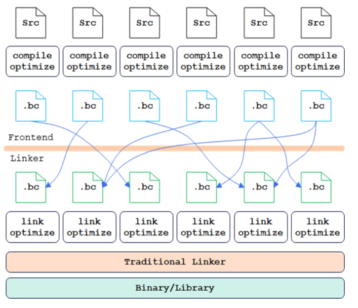

# 编译优化技术介绍

> [!NOTE]
>
> 在当前版本中，编译优化仅作为一项试用特性，此功能在后续版本中可能会有所调整或改进。请用户在使用过程中关注后续版本的迭代。

## 编译技术：LTO链接时优化

LTO是成熟的编译优化技术，业界已经广泛使用。可以通过跨文件函数内联，减小调用开销，通过跨文件函数特化、常量传播，消除冗余代码，也可以实现跨语言优化。由此带来较为可观的性能收益，从top-down分析角度来说，对前后端瓶颈均有一定的效果。LTO优化技术分为FullLTO和ThinLTO两种，ThinLTO是一种更新的链接时优化技术，ThinLTO在运行时比FullLTO具有更好的性能表现，极大地缩短了链接时优化的耗时和内存占用。

**图 1**  LTO优化原理图  

## 编译技术：PGO反馈优化

PGO （Profile-Guided Optimization）是一种编译器优化技术。它通过在程序运行时收集性能数据，并在编译阶段使用这些数据来优化程序的性能。PGO需要两次编译过程，第一次编译时在应用代码中插桩，通过运行典型用例和业务，收集应用代码中函数及分支的执行次数信息，第二次编译时根据运行统计信息进一步优化，生成高性能应用。PGO的反馈优化技术在数据库、分布式存储等数据和计算密集型等前端瓶颈较高的场景效果显著，性能可提升10-30%。它能够有效减少计算时间和资源消耗，提升应用性能，显著降低运营成本并提高用户体验。

## 编译优化方案介绍

通过毕昇编译器的LTO和PGO编译优化技术，并编译Python、PyTorch、torch\_npu（Ascend Extension for PyTorch）三个组件，可以有效提升程序性能。

由于Pybind11框架原因，相关编译优化包之间的兼容性可能存在冲突，可以参考下表选择部分包的编译优化或者全部包的编译优化，后续编译优化指导以毕昇编译器为例开展。

**表 1**  兼容性组合

|Python|PyTorch|torch_npu|是否兼容|
|--|--|--|--|
|gcc（默认）|gcc（默认）|gcc（默认）|是|
|gcc（默认）|gcc（默认）|毕昇|否|
|gcc（默认）|毕昇|gcc（默认）|否|
|gcc（默认）|毕昇|毕昇|是|
|毕昇|gcc（默认）|gcc（默认）|是|
|毕昇|gcc（默认）|毕昇|否|
|毕昇|毕昇|gcc（默认）|否|
|毕昇|毕昇|毕昇|是|
