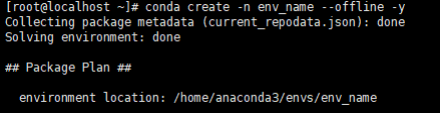

# 编译优化（Python）

Python从3.6以上开始支持LTO（链接时优化）与PGO（剖面导向优化）优化，可以在编译时开启。

1. 依赖安装。

    基于Unix的系统，Python源码编译时会尝试使用可用的系统库。只有相关系统头文件可用时，才会构建可选组件，如果编译时头文件不可用，编译可以完成，但运行程序时如果调用到该组件，则会报错。

    - 在基于Fedora、RHEL、CentOS和其他dnf的系统上：

        ```shell
        sudo dnf install gcc gcc-c++ gdb lzma glibc-devel libstdc++-devel openssl-devel \
        readline-devel zlib-devel libffi-devel bzip2-devel xz-devel \
        sqlite sqlite-devel sqlite-libs libuuid-devel gdbm-libs perf \
        expat expat-devel mpdecimal python3-pip
        ```

    - 在基于Debian、Ubuntu和其他apt的系统上：

        ```shell
        sudo apt-get install build-essential gdb lcov pkg-config \
        libbz2-dev libffi-dev libgdbm-dev libgdbm-compat-dev liblzma-dev \
        libncurses5-dev libreadline6-dev libsqlite3-dev libssl-dev \
        lzma lzma-dev tk-dev uuid-dev zlib1g-dev libmpdec-dev
        ```

2. 获取源码。

    根据实际需要选择对应版本Python源码下载并解压，源码下载地址为[https://www.python.org/downloads/source/](https://www.python.org/downloads/source/)  。

    以Python 3.8.17为例，解压文件后进入对应目录。

    ```shell
    tar -xvf Python-3.8.17.tgz
    cd Python-3.8.17
    ```

3. 编译安装。<a id="li2673165610272"></a>
    - 毕昇环境变量配置详见[安装毕昇编译器](install_bisheng_comp.md)，另外需设置如下环境变量：

        ```shell
        export CC=clang
        export CXX=clang++
        ```

    - 执行命令mkdir -p <Python要安装到的目录（绝对路径）>，创建Python安装目录。

        如需使用conda进行环境管理，可参照[4](#li10673155619274)指定安装目录。

    - 执行./configure --prefix=<Python要安装到的目录（绝对路径）> --with-lto --enable-optimizations
    - 执行以下命令，进行编译。

        ```shell
        make -j
        ```

    - 执行以下命令，进行安装。

        ```shell
        make install
        ```

4. 配置使用。<a id="li10673155619274"></a>
    - 安装目录里使用./bin/python3即可打开安装好的Python，可执行文件并进入Python命令行。
    - 通过conda进行环境管理，首先执行命令conda create -n env_name --offline -y，创建一个空的conda环境。

        在[3](#li2673165610272)编译的时候直接指定Python安装目录为该空环境所在目录，即下图中的environment location。安装成功后即可直接使用conda activate env_name激活环境。当前编译完成的bin目录下有python3和pip3可以直接使用，进入该Python环境的bin目录执行ln -s python3 python和ln -s pip3 pip命令，创建软链接，即可在当前conda环境使用python/pip。

        
