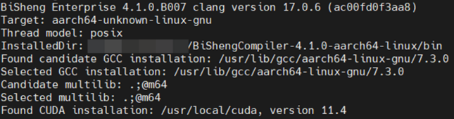

# 安装毕昇编译器

## 下载毕昇编译器

毕昇编译器可以从鲲鹏社区官网下载获取。请单击[LINK](https://kunpeng-repo.obs.cn-north-4.myhuaweicloud.com/BiSheng%20Enterprise/BiSheng%20Enterprise%20203.0.0/BiShengCompiler-4.1.0-aarch64-linux.tar.gz)下载毕昇编译器4.1.0版本。

## 安装毕昇编译器

1. 解压毕昇包。

    ```shell
    tar -xvf BiShengCompiler-4.1.0-aarch64-linux.tar.gz
    ```

2. 配置环境变量。

    ```shell
    export PATH=$(pwd)/BiShengCompiler-4.1.0-aarch64-linux/bin:$PATH
    export LD_LIBRARY_PATH=$(pwd)/BiShengCompiler-4.1.0-aarch64-linux/lib:$LD_LIBRARY_PATH
    ```

3. 执行`clang -v`命令，验证是否安装成功，打印如下信息表示安装成功。

    
