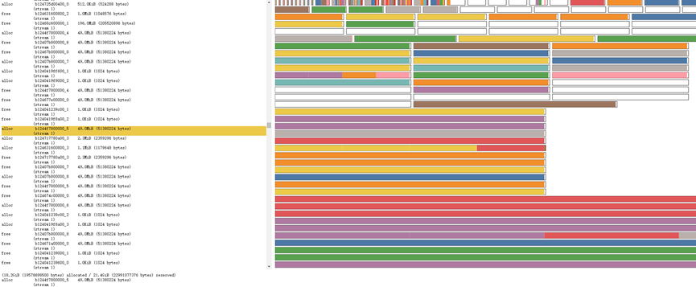

# 内存快照

## 简介

支持训练过程中内存溢出（OOM）时生成设备内存快照，并通过交互式查看器（[memory\_viz](https://pytorch.org/memory_viz)）进行可视化分析。快照能够记录分配的NPU内存在任意时间点的状态，并且可以选择性地记录该快照分配情况的历史记录。该特性基于社区内存快照特性（[LINK](https://pytorch.org/docs/2.1/torch_cuda_memory.html#understanding-cuda-memory-usage)）开发，支持社区内存快照的使用方式。内存快照效果图如下所示：

**图 1**  内存占用状态示意图  


横轴为时间轴，纵轴为当前占用设备内存大小。通过上图，可以直观看到随着时间推移正在使用的内存状态。支持平移放大操作来查看图中较小的内存分配块，对于分配的每个内存块，可以查看相应的堆栈以及分配信息。

同时，支持查看内存分配器状态的历史记录。通过选择左侧时间轴显示的各个内存分配器执行的事件，可以查看执行该事件操作时，内存分配器状态的可视化摘要。此摘要显示了程序申请返回的每个单独内存段，以及根据实际申请使用内存大小，将其分割为单独分配或者空闲的内存块。同样的，也支持查看分配内存时的堆栈信息。效果如下图所示：

**图 2**  内存分配器状态历史记录示意图  


另外，在保存内存快照的同时，内存溢出（OOM）时各组件当前实时占用的内存（curMemSize）和运行过程中的最大占用内存（memPeakSize）都被保存到OOM\_SNAPSHOT\_PATH路径下的csv文件中，用户可以将csv文件下载后用excel等工具查看。

通过环境变量OOM\_SNAPSHOT\_ENABLE和OOM\_SNAPSHOT\_PATH，来控制内存快照的记录情况。当配合TASK\_QUEUE\_ENABLE=2使用时，还可以查看taskqueue多级流水申请的workspace内存使用情况。

## 使用场景

在模型训练过程中，网络发生OOM时，需要分析模型训练过程中NPU内存分配情况时，可以使用该特性。

## 使用指导

-   在网络发生内存不足报错时，可通过OOM\_SNAPSHOT\_ENABLE配置是否保存内存快照，以供分析内存不足原因。
    -   取值为0时，关闭内存快照功能，不保存内存数据。
    -   取值为1时，在OOM时，保存当前和历史内存使用信息，包含申请和释放的内存信息。
    -   取值为2时，在OOM时，仅保存当前内存使用情况，包含申请和释放的内存信息。

-   在网络发生内存不足报错时，可通过OOM\_SNAPSHOT\_PATH配置内存数据保存路径。需与OOM\_SNAPSHOT\_ENABLE配套使用。
    -   未配置时，内存数据默认保存至当前路径。

    -   配置时，内存数据保存至指定路径。

此环境变量使用详情请参考《环境变量参考》中的“[OOM\_SNAPSHOT\_ENABLE](../environment_variable_reference/OOM_SNAPSHOT_ENABLE.md)”章节和《环境变量参考》中的“[OOM\_SNAPSHOT\_PATH](../environment_variable_reference/OOM_SNAPSHOT_PATH.md)”章节。

内存快照的使用方法和案例还可参考社区的相关说明[LINK](https://pytorch.org/docs/2.7/torch_cuda_memory.html#understanding-cuda-memory-usage)。社区内存快照的API具体用法请参考[LINK](https://pytorch.org/docs/2.7/torch_cuda_memory.html#snapshot-api-reference)。

> [!NOTE]  
>在使用社区的API接口时，需要将API名称中的cuda转换为NPU形式才能使用：torch.cuda.\*\*\*转换为torch\_npu.npu.\*\*\*。

## 使用样例

```shell
export OOM_SNAPSHOT_ENABLE=1
export OOM_SNAPSHOT_PATH="/home/usr/"
```

## 约束说明

-   Ascend Extension for PyTorch 6.0.0及以上版本支持该功能。
-   内存溢出（OOM）时保存内存快照csv文件特性，仅在Ascend HDK 25.5.0及以上版本和CANN商发8.5.0及以上版本上支持。

