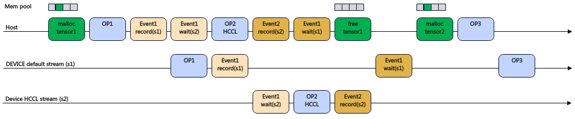

# 多流内存复用

## 简介

流（stream）是PyTorch的一个重要机制，每个流代表一个时序上严格的执行逻辑。一般地，PyTorch在执行时会启动多个流，来并行完成模型的通信和计算任务。每个流在执行过程中会根据自身需要向设备（device）申请内存，称为该流的内存池。如果一个流申请的内存池需要给另一个流使用，两个流之间需要进行通信，以当前流的内存块（block）对应的数据执行完作为对应流使用这块内存的标志。host算子下发过快时，计算流的算子来不及复用通信流上的内存，特别是通信流上的算子有依赖时，需要全部结束再释放复用。

多流复用的逻辑就是让通信流上的内存提前释放，让计算流复用。通过寻找合适的时机擦除内存管理中在调用记录流（recordStream）时增加的标记。work.wait\(\)会下发一个Event wait任务阻塞计算任务，从device执行来看只有当集合通信算子执行完成后，wait阻塞才会解除，这个时候集合通信算子所依赖的内存已经被集合通信任务使用完，不需要跨流依赖标记延迟释放，因此可以直接擦除。擦除跨流依赖标记的内存块在tensor析构后会直接返回内存池。work.wait\(\)之后这个内存块会被分给其他算子使用，之后的算子一定是在device上Event wait任务之后，也就是集合通信算子之后使用这块内存，因此不会与集合通信算子同时操作。以此实现多流复用。

未开启多流复用示意图如[图1](#未开启多流内存复用示意图)所示。在析构tensor1（free tensor1）时，原生PyTorch框架为保证tensor1内存在HCCL算子使用完成后释放，析构tensor1（free tensor1）后内存不立即被内存池回收，而是下发Event3 record任务。在下一次内存申请前，查询到Event3 record完成后，才回收这部分内存到内存池。图中malloc tensor2由于查询Event3 record未完成，因此tensor1内存不能被内存池及时回收，因此不能复用。

**图 1**  未开启多流内存复用示意图  <a id="未开启多流内存复用示意图"></a>


开启多流复用示意图如[图2](#开启多流内存复用示意图)所示。Event1 wait任务后，跨流依赖标记也被一起擦除，不需要下发Event3 record任务。析构tensor1（free tensor1）后，tensor1内存会直接被内存池回收。

**图 2**  开启多流内存复用示意图  <a id="开启多流内存复用示意图"></a>
  

## 使用场景

大模型分布式训练场景下，为了避免内存越界访问，并且想提高跨流内存复用率的情况下，可以考虑使用该特性。

## 使用指导

通过环境变量MULTI\_STREAM\_MEMORY\_REUSE来控制是否开启多流内存复用。

-   0：关闭内存复用。
-   1：开启内存复用，基于eraseStream的方式，把之前的recordStream标记进行擦除，保证内存复用，持有tensor的弱引用，不延长tensor的生命周期。
-   2：开启内存复用，基于不执行recordStream标记的方法，保证内存复用能力，持有tensor的强引用，可能延长tensor的生命周期，当前不推荐使用。
-   3：开启内存复用，基于设置值为“1“做了进一步复用优化，可以在tensor提前释放的场景下，擦除recordStream标记。

默认值是1。

此环境变量使用详情请参考《环境变量参考》中的“[MULTI\_STREAM\_MEMORY\_REUSE](https://www.hiascend.com/document/detail/zh/Pytorch/720/comref/Envvariables/Envir_016.html)”章节。

## 使用样例

关闭内存复用：

```
export MULTI_STREAM_MEMORY_REUSE=0
```

## 约束说明

无

