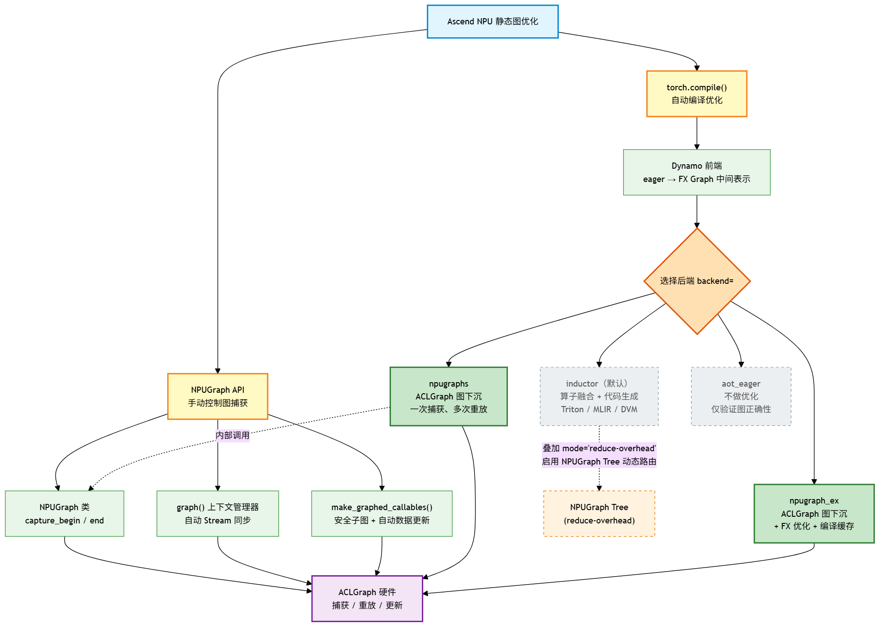
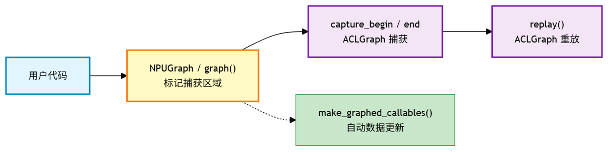
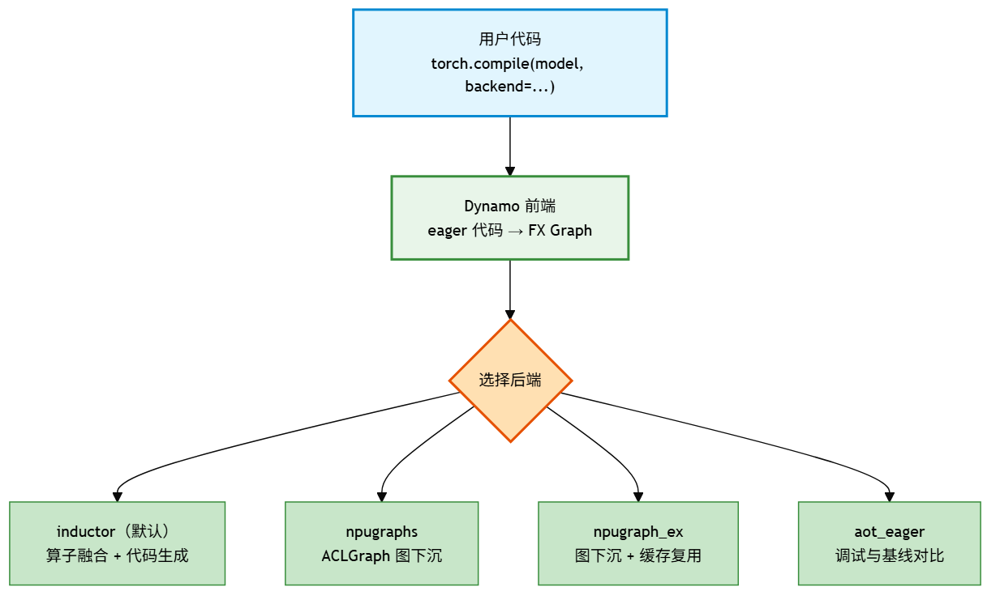
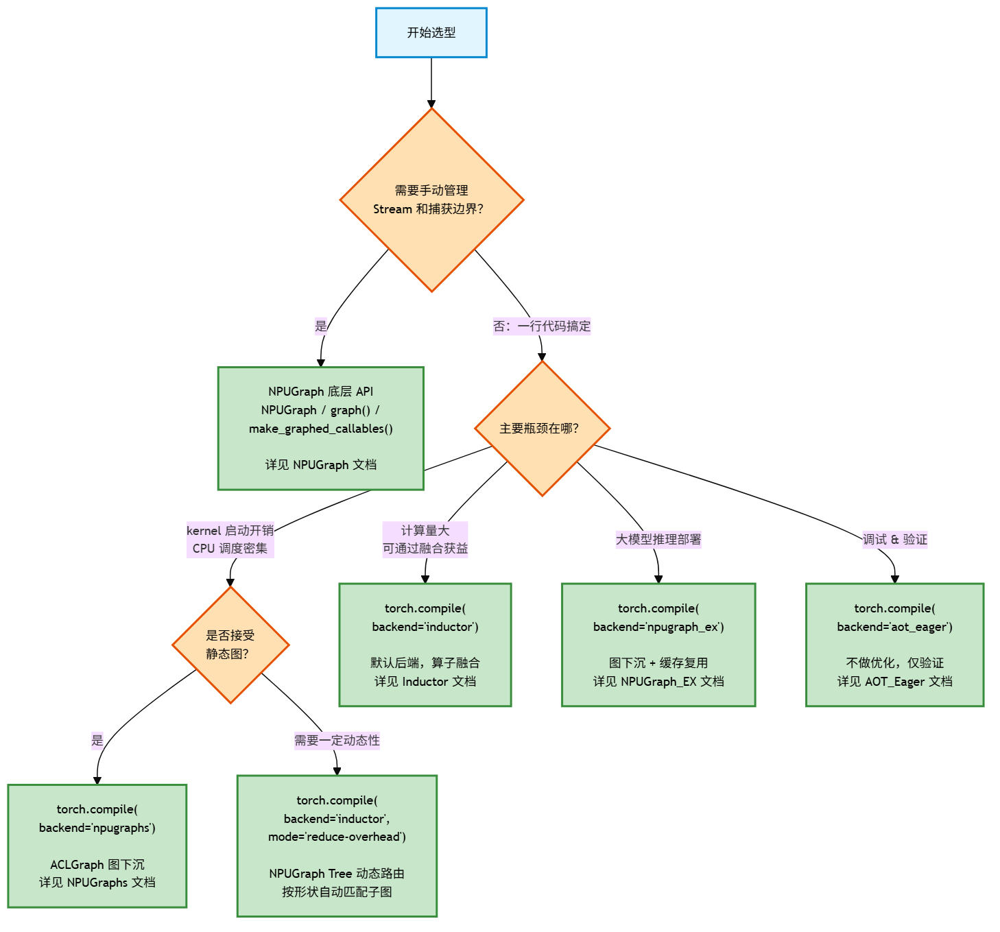

# 图模式概述

Ascend NPU 平台的静态图优化能力通过两种方式向用户暴露：

1. **NPUGraph 底层 API** — 手动控制图捕获、重放、更新，精细但需理解底层机制
2. **torch.compile()** — 全自动编译入口，一行代码完成图捕获和优化，内部可选不同后端

**核心关系一句话：** `torch.compile(backend="npugraphs")` 本质是把 NPUGraph 底层 API 的捕获-重放流程自动化了。两者是"手动挡"和"自动挡"的关系，不是竞争关系。

## 全景架构

[](../figures/npugraph_concept_map.png)

图中关键信息：NPUGraph API 和 npugraphs/npugraph_ex 后端都通过 ACLGraph 硬件层实现图捕获重放；inductor 和 aot_eager 是独立后端，不走 ACLGraph。

## 概念辨析

NPUGraph 相关概念容易混淆，因为它们共享"NPUGraph"这个词、都涉及"图"这个东西，但各处于不同抽象层级。

### 一张表说清五个概念

| 概念 | 所处层级 | 一句话定义 | 典型代码 |
|------|---------|-----------|---------|
| **ACLGraph** | L1 硬件运行时 | NPU 驱动层的图捕获/重放机制，是全部上层能力的硬件底座 | `aclmdlRICaptureBegin/End` |
| **NPUGraph 类** | L4 Python API | 手动挡方向盘——开发者显式调用 capture/replay 的 Python 对象 | `graph = NPUGraph(); graph.capture_begin()` |
| **make_graphed_callables()** | L4 Python API | 手动挡的巡航模式——自动处理数据更新，适合含动态控制流的模型 | `module = make_graphed_callables(module, args)` |
| **backend="npugraphs"** | torch.compile 后端 | 自动挡——把整段计算自动下沉为 ACLGraph，无需手动管理 | `torch.compile(model, backend="npugraphs")` |
| **mode="reduce-overhead"** | torch.compile 优化模式 | 自动挡的运动模式——在 inductor 融合算子基础上，用 NPUGraph Tree 消除调度开销 | `torch.compile(model, mode="reduce-overhead")` |

### Inductor 与 NPUGraph 不是竞争关系

这是最常见的困惑点。两者的区别：

| 维度 | Inductor（算子融合） | NPUGraph / ACLGraph（图捕获） |
|------|---------------------|------------------------------|
| **优化手段** | 改变计算方式——把多个小 kernel 合并成一个大 kernel | 不改变计算方式——把现有 kernel 打包批量提交 |
| **消除的开销** | kernel 数量多、内存读写冗余（计算层） | CPU 逐个启动 kernel 的间隙（调度层） |
| **形状要求** | 支持动态形状（触发重编译） | 静态内存模型（形状变化触发重录制，有开销但可用） |
| **类比** | 把多道独立工序合并为一条流水线 | 把多批货统一调度、一次发车 |

两者可以叠加使用：

```python
# Inductor 先融合算子减少 kernel 数量
# NPUGraph Tree 再消除 kernel 启动间隙
compiled_model = torch.compile(model, backend="inductor", mode="reduce-overhead")
```

## 两条使用路径

### 路径一：NPUGraph 底层 API — 手动精细控制

适用于需要精确控制哪些代码入图的场景。你决定捕获边界、管理 Stream、分区域处理。

[](../figures/npugraph_manual_path.png)

| API | 控制力 | 适用场景 |
|-----|--------|---------|
| `NPUGraph` 类 + `capture_begin/end` | 最高，需手动管理 Stream | 多 Stream 协同、分区域捕获 |
| `graph()` 上下文管理器 | 中等，自动 Stream 同步 | 快速上手，单流场景 |
| `make_graphed_callables()` | 高级封装，自动数据更新 | 含动态控制流的安全子图捕获 |

详见 [NPUGraph](./pytorch_npugraph_desc.md)。

### 路径二：torch.compile() — 全自动编译

适用于大多数场景。一行代码，自动完成前端捕获和后端优化。

[](../figures/npugraph_torch_compile_path.png)

核心流程：**Dynamo 前端**将 eager 代码转为 FX Graph 中间表示 → **后端**接收 FX Graph 并执行优化策略。

详见 [PyTorch 图模式（torch.compile）](./pytorch_graph_mode.md)。

## 后端选型指南

### 后端能力对比

四个后端通过 `torch.compile(backend=...)` 指定，同一层级、互斥选择：

| 后端 | 核心机制 | 适用场景 | 一句话建议 |
|------|---------|---------|-----------|
| **inductor** | 算子融合 + 代码生成 | 大多数场景 | 不确定时默认选它 |
| **npugraphs** | ACLGraph 图捕获重放 | kernel 调用频繁、CPU 调度瓶颈 | kernel 启动是瓶颈时选它 |
| **npugraph_ex** | 图下沉 + FX 优化 + 缓存 | 大模型推理部署 | 对接服务化框架时选它 |
| **aot_eager** | 不做优化，仅验证正确性 | 调试/基线对照 | 怀疑其他后端有问题时用 |

详见 [后端文档](./pytorch_graph_mode.md) 中各后端详细说明。

### 选型决策树

[](../figures/npugraph_decision_tree.png)

## 文档索引

- **[NPUGraph](./pytorch_npugraph_desc.md)** — 底层 API 详解：Capture-Replay-Update 机制、`make_graphed_callables` 高级用法
- **[PyTorch 图模式](./pytorch_graph_mode.md)** — `torch.compile()` 编译入口及各后端文档
