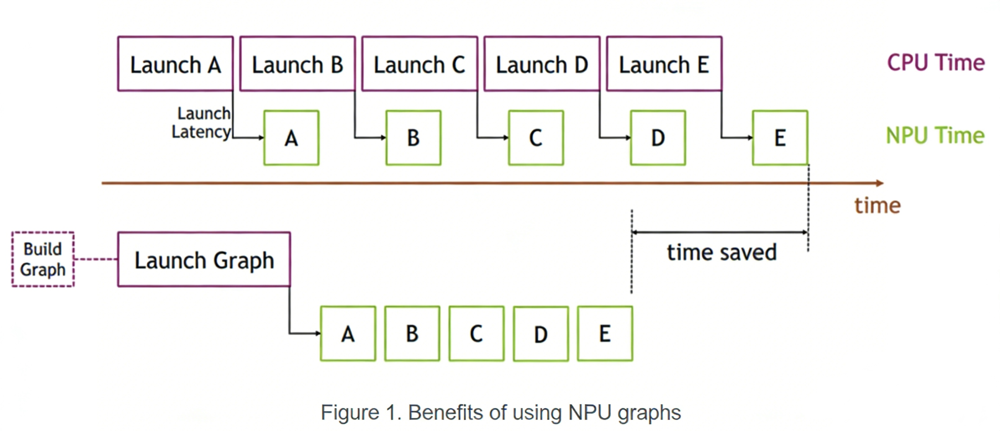

# NPUGraph

## 简介

NPUGraph是一种静态图捕获技术，可以将动态的PyTorch操作转换为固定计算图，提升NPU执行效率。将一系列NPU内核定义并封装为一个单元（即操作图），而非单独启动的一系列操作。它提供了通过单一CPU操作启动多个NPU操作的机制，从而减少了启动开销其核心思想与[CUDAGraphs](https://pytorch.org/blog/accelerating-pytorch-with-cuda-graphs/)一致。

### 工作原理

PyTorch支持通过流捕获机制构建NPU计算图，具体流程如下：

1. NPU图捕获模式<br>
开启捕获：将NPU流置于捕获模式后，发送到该流的NPU工作不会立即执行，而是被记录为计算图结构。<br>
图记录：捕获期间，所有内核调用及参数（包括指针地址）被静态记录。
2. 图重放与内存管理<br>
重放机制：捕获完成后，可通过启动图多次重放相同计算逻辑，每次重放使用完全相同的kernel和参数。<br>
动态数据更新：对于指针参数（如输入张量），需在每次重放前将新数据（如新批次数据）写入原有内存地址，实现数据更新而无需重建图。

### 核心优势

图重放机制通过牺牲动态图执行的灵活性，换取显著的CPU开销降低。具体优势如下：

1. 固定计算图结构<br>
参数与内核在捕获阶段确定后不再变更，重放时无需重复进行参数校验、内核选择等操作。
避免了Python解释器、C++框架层及驱动层的调度开销。
2. 高效执行流程<br>
重放时直接调用底层启动接口，将整个图任务批量提交至NPU。
NPU内核执行效率略有提升，但核心优势在于跳过CPU端多层调度开销（如内核启动准备、内存映射管理等）。

NPUGraph的优势可以通过下图展示：



> [!NOTE]
> 
> CPU逐个启动一列短核时，CPU启动开销会在核之间造成显著间隙。而使用NPUGraph替代这串核序列，最初需要花更多时间构建图并一次性启动整个图，但后续执行会非常快，因为核间的间隙非常小。当同一操作序列重复多次（例如训练步数非常多）时，差异更为明显。构建和启动图的初始成本将在整个训练迭代次数中摊销。

## 适用场景

**推荐使用NPUGraph的场景：**

- 网络结构完全或部分为静态图（图安全）
- 存在CPU瓶颈（特别是短内核密集型任务）
- 小批量训练场景（NPU利用率低）
- 输入形状固定的推理或训练任务
- 高迭代次数的重复计算任务
- 仅支持aclnn算子入图

**NPUGraph不适用的场景：**

- 动态形状输入（每批次尺寸变化）
- 动态控制流（条件分支、循环结构可变）
- 需要频繁CPU-NPU同步的操作

## API 概述

NPUGraph提供了三种使用方式：

- NPUGraph类（`torch_npu.npu.NPUGraph`）：底层控制，手动管理。
- graph上下文管理器（`torch_npu.npu.graph`）：简化版捕获。简单通用的上下文管理器，可在其作用域内捕获NPU操作。
- make_graphed_callables（ `torch_npu.npu.make_graphed_callables` ）：高级封装，自动处理细节。若网络部分不适合捕获（例如，由于动态控制流、动态网络拓扑、CPU同步或关键的CPU端逻辑），可使用该API进行安全子图捕获。

## 使用示例

### 使能方式一：使用NPUGraph类

`torch_npu.npu.NPUGraph` 是底层原始类，提供对捕获流程的精细控制。使用时需手动管理Stream、调用 `capture_begin()` 和 `capture_end()`。

```python
import torch
import torch_npu

def graph_capture_simple():
    s = torch_npu.npu.Stream()

    with torch_npu.npu.stream(s):
        a = torch.full((1000,), 1, device="npu")
        g = torch_npu.npu.NPUGraph()
        torch_npu.npu.empty_cache()
        g.capture_begin()
        b = a
        for _ in range(10):
            b = b + 1
        g.capture_end()
    torch_npu.npu.current_stream().wait_stream(s)

    g.replay()

    print(f"b.sum().item() == {b.sum().item()}.")

graph_capture_simple()
```

### 使能方式二：使用graph上下文管理器

`torch_npu.npu.graph` 是简单通用的上下文管理器，可在其作用域内捕获NPU操作。相比手动调用 `capture_begin()` 和 `capture_end()`，该方式更加简洁，自动处理Stream同步和缓存清理。

```python
import torch
import torch_npu

def graph_simple():
    a = torch.full((1000,), 1, device="npu")
    g = torch_npu.npu.NPUGraph()
    with torch_npu.npu.graph(g):
        b = a
        for _ in range(10):
            b = b + 1

    g.replay()

    print(f"b.sum().item() == {b.sum().item()}.")

graph_simple()
```

### 使能方式三：安全子图捕获

当网络中存在不可捕获部分（如动态控制流、动态形状、CPU同步或必要CPU侧逻辑）时，可将安全部分通过 `torch_npu.npu.make_graphed_callables` 封装为图化可调用对象，其余部分保持eager执行。

```python
import torch
import torch_npu
from torch_npu.contrib import transfer_to_npu
import torch.nn as nn
import torch.optim as optim
from itertools import chain

def main():
    # 1. 环境检查：验证 NPU 可用性
    if not torch.npu.is_available():
        print("# NPU 不可用，请在支持 NPU 的环境中运行本示例")
        return
    print(f"# PyTorch 版本：{torch.__version__}")
    print(f"# torch_npu 版本：{torch_npu.__version__}")
    print(f"# NPU 设备数量：{torch.npu.device_count()}")

    # 2. 可复现性设置
    torch.manual_seed(42)
    torch.npu.manual_seed(42)

    # 3. 模型定义与 NPU 迁移
    N, D_in, H, D_out = 640, 4096, 2048, 1024
    module1 = nn.Linear(D_in, H).npu()
    module2 = nn.Linear(H, D_out).npu()
    module3 = nn.Linear(H, D_out).npu()

    loss_fn = nn.MSELoss().npu()
    optimizer = optim.SGD(
        chain(module1.parameters(), module2.parameters(), module3.parameters()),
        lr=0.1
    )

    # 4. 准备捕获用静态张量（requires_grad 状态需与实际输入匹配）
    x = torch.randn(N, D_in, device='npu')  # module1 输入无需梯度
    h = torch.randn(N, H, device='npu', requires_grad=True)  # module2/3 输入需梯度

    # 5. 使用 make_graphed_callables 捕获子图
    print("# 捕获 NPUGraph 子图")
    module1 = torch_npu.npu.make_graphed_callables(module1, (x,))
    module2 = torch_npu.npu.make_graphed_callables(module2, (h,))
    module3 = torch_npu.npu.make_graphed_callables(module3, (h,))
    print("# NPUGraph 子图捕获完成")

    # 6. 准备真实训练数据
    real_inputs = [torch.randn_like(x) for _ in range(10)]
    real_targets = [torch.randn(N, D_out, device='npu') for _ in range(10)]

    # 7. 执行训练迭代（含动态分支）
    print("# 开始 10 次迭代（使用 NPUGraphed Callables）")
    for i, (data, target) in enumerate(zip(real_inputs, real_targets)):
        optimizer.zero_grad(set_to_none=True)

        # 前向：module1 无条件执行
        tmp = module1(data)  # 图化前向

        # 动态分支：根据中间结果选择 module2 或 module3
        # ⚠️ 注意：NPUGraph 要求分支结构在捕获时确定；此处分支仅影响复用哪个图，
        #        各分支内部计算图保持静态，因此安全可用
        if tmp.sum().item() > 0:
            tmp = module2(tmp)  # 图化前向
        else:
            tmp = module3(tmp)  # 图化前向

        loss = loss_fn(tmp, target)
        loss.backward()  # 对应选中模块的图化反向 + module1 反向
        optimizer.step()

        if i == 0 or i == 9:
            param_sum = sum(p.sum().item() for p in chain(
                module1.parameters(), module2.parameters(), module3.parameters()))
            print(f"# 迭代{i+1}: 模型参数总和={param_sum:.6f}, 损失={loss.item():.6f}")

    print("# 所有迭代完成")
    print("# NPUGraphed Callables 功能验证成功")

if __name__ == "__main__":
    main()
```
