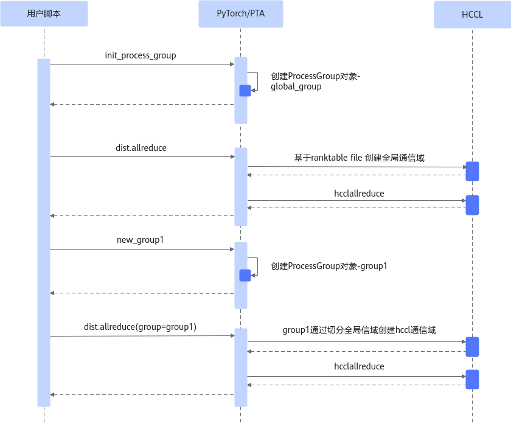

# ranktable建链

## 简介

支持以ranktable文件配置方式建立通信域，来加速通信域建立时间，并做到建链时间几乎和集群规模无关，从而解决大集群下建立通信域的性能瓶颈。

**图 1**  通过ranktable建立通信域的流程图  


PyTorch通过ranktable文件建立全局通信域。子通信域的建立通过对全局通信域做切分实现。

## 使用场景

大集群下，模型通信域的建立成为模型训练的性能瓶颈时，可以考虑该特性。

## 使用指导

通过环境变量RANK\_TABLE\_FILE控制是否通过ranktable文件配置进行集合通信域建链。

-   未配置时，通过默认的协商流程进行集合通信域建链。
-   配置且文件全路径有效时，通过ranktable文件进行集合通信域建链。

此环境变量默认为未配置。

 ranktable文件配置说明请参考《[HCCL集合通信库用户指南](https://www.hiascend.com/document/detail/zh/canncommercial/850/commlib/hcclug/hcclug_000001.html)》中对应的“rank table配置资源信息”章节。

> [!CAUTION] 
>-   配置的文件路径不存在时，会通过默认的协商流程进行集合通信域建链。
>-   配置的文件路径存在，但配置信息有误时，不会通过默认的协商流程进行集合通信域建链，而是在实际通信时会进行相应的报错。
>-   配置的文件路径不能为软链接，且存在读取权限。

此环境变量使用详情请参考《环境变量参考》中的“[RANK\_TABLE\_FILE](../environment_variable_reference/RANK_TABLE_FILE.md)”章节。

## 使用样例

启用ranktable文件方式建链示例：

```
export RANK_TABLE_FILE=/home/ranktable.json
```

关闭ranktable文件方式建链示例：

```
unset RANK_TABLE_FILE
```

## 约束说明

此环境变量仅适用于基于PyTorch框架构建的神经网络的场景，且在分布式集合通信的场景中使用。

