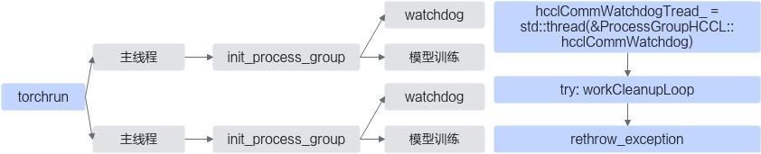

# WatchDog

## 简介

在不影响大模型训练性能和精度的前提下，能快速稳定发现错误。WatchDog监视进程，可提高使用HCCL的PyTorch分布式训练的可靠性。WatchDog本质上是通过捕获集合通信中出现的错误，从子进程抛出异常，停止主进程训练，来防止分布式训练被阻塞。

**图 1**  WatchDog工作示意图  


上图展示了WatchDog进程在分布式训练中如何工作。首先，WatchDog线程在每一个进程初始化process\_group时启动，一个WatchDog线程监视一个进程中的process\_group。然后，WatchDog线程在workCleanupLoop子函数中异步监视集合通信异常，通过捕获到异常后在WatchDog主函数中将异常重新抛出，使得训练的主进程能感知到异常，从而快速结束训练任务。

WatchDog不仅支持算子执行异常监测、通信超时监测、超时分析，还支持ERROR CQE检测。CQE检测是检测device网口通信链路情况，当通信链路异常时，通常反映为ERROR CQE。

## 使用场景

大模型训练过程中，模型集合通信异常后停滞，不能及时结束训练，造成资源损耗。使用该特性可避免该情况发生。

## 使用指导

通过环境变量HCCL\_ASYNC\_ERROR\_HANDLING可以设置是否启用WatchDog。

HCCL\_ASYNC\_ERROR\_HANDLING取值情况：

-   0：不开启异步错误处理。
-   1：开启异步错误处理。

当PyTorch版本为1.11.0时，默认值为0；当PyTorch版本大于等于2.1.0时，默认值为1。

此环境变量使用详情请参考《环境变量参考》中的“[HCCL\_ASYNC\_ERROR\_HANDLING](https://www.hiascend.com/document/detail/zh/Pytorch/720/comref/Envvariables/Envir_018.html)”章节。

## 使用样例

开启异步错误处理：

```shell
export HCCL_ASYNC_ERROR_HANDLING=1
```

## 约束说明

-   此环境变量仅适用于基于PyTorch框架构建的神经网络的场景，且使用HCCL作为通信后端。
-   通过此环境变量开启异步错误处理时，为了更好地明确HCCL超时原因，建议new\_group和init\_process\_group传参的timeout时间大于HCCL\_CONNECT\_TIMEOUT和HCCL\_EXEC\_TIMEOUT环境变量配置的时间，HCCL\_CONNECT\_TIMEOUT具体参考《CANN 环境变量参考》中的“[HCCL\_CONNECT\_TIMEOUT](https://www.hiascend.com/document/detail/zh/canncommercial/83RC1/maintenref/envvar/envref_07_0077.html)”章节，HCCL\_EXEC\_TIMEOUT具体请参考《CANN 环境变量参考》中的“[HCCL\_EXEC\_TIMEOUT](https://www.hiascend.com/document/detail/zh/canncommercial/83RC1/maintenref/envvar/envref_07_0078.html)”章节。

