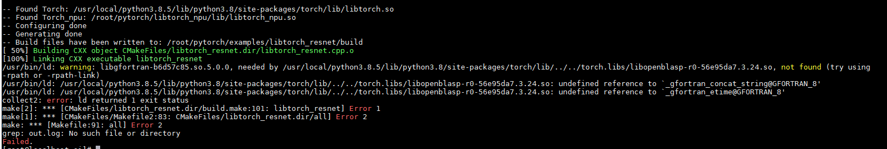

# torch.libs/libopenblasp-r0-56e95da7.3.24.so不存在

## 问题描述

aarch64环境下进行libtorch推理测试，编译时依赖torch.libs/\*.so库，需要手动加载。

-   报错截图

    

-   报错文本

    ```ColdFusion
    [100%] Linking CXX executable libtorch_resnet
    /usr/bin/ld: warning: libgfortran-b6d57c85.so.5.0.0, needed by /usr/local/python3.8.5/lib/python3.8/site-packages/torch/lib/../../torch.libs/libopenblasp-r0-56e95da7.3.24.so, not found (try using     -rpath or -rpath-link)
    /usr/bin/ld: /usr/local/python3.8.5/lib/python3.8/site-packages/torch/lib/../../torch.libs/libopenblasp-r0-56e95da7.3.24.so: undefined reference to `_gfortran_concat_string@GFORTRAN_8'
    /usr/bin/ld: /usr/local/python3.8.5/lib/python3.8/site-packages/torch/lib/../../torch.libs/libopenblasp-r0-56e95da7.3.24.so: undefined reference to `_gfortran_etime@GFORTRAN_8'
    collect2: error: ld returned 1 exit status
    make[2]: *** [CMakeFiles/libtorch_resnet.dir/build.make:101: libtorch_resnet] Error 1
    make[1]: *** [CMakeFiles/Makefile2:83: CMakeFiles/libtorch_resnet.dir/all] Error 2
    make: *** [Makefile:91: all] Error 2
    ```

## 处理方法

在CMakeLists.txt编译文件中增加torch.libs/\*.so库的链接，代码示例如下：

```
set(CMAKE_CXX_FLAGS "${CMAKE_CXX_FLAGS} ${TORCH_CXX_FLAGS}")

# 在执行模型代码前增加torch.libs/*.so库的链接，请根据实际情况替换以下命令行中的该库的路径
link_directories(/usr/local/python3.8.5/lib/python3.8/site-packages/torch.libs)  

add_executable(libtorch_resnet libtorch_resnet.cpp)
target_link_libraries(libtorch_resnet "${TORCH_LIBRARIES}")
target_link_libraries(libtorch_resnet "${TORCH_NPU_LIBRARIES}")
```

