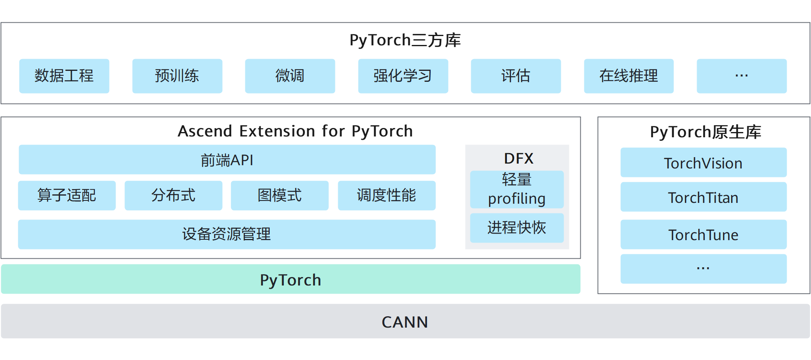
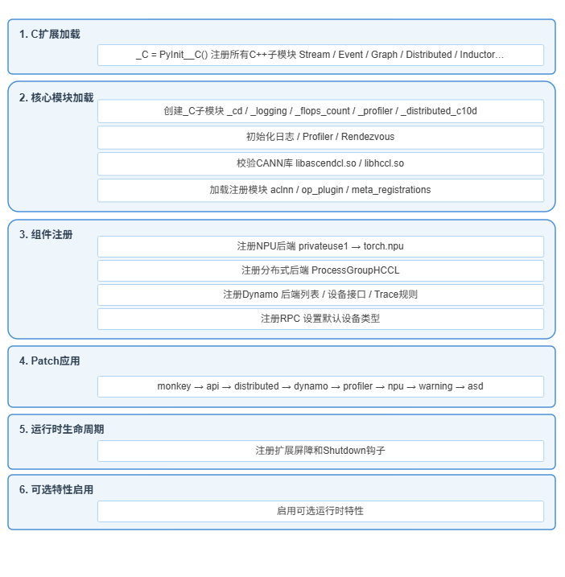
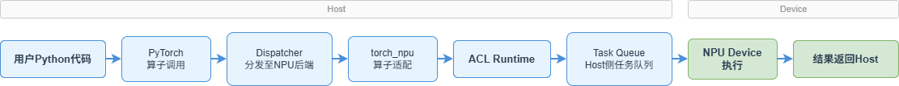
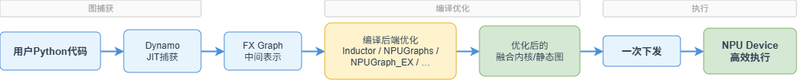
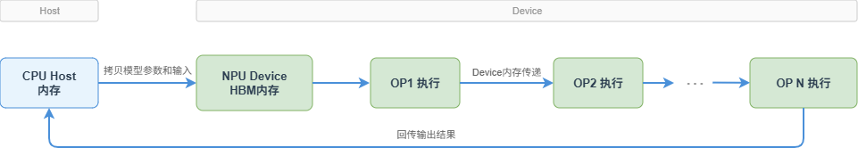

# Ascend Extension for PyTorch是什么

Ascend Extension for PyTorch（即torch_npu插件）是基于昇腾的深度学习适配框架，使昇腾NPU可以支持PyTorch框架，为PyTorch框架的使用者提供昇腾AI处理器的超强算力。

项目源码地址请参见[Link](https://gitcode.com/Ascend/pytorch)。

## 实现总览

Ascend Extension for PyTorch采用**设备适配**的实现方案，将昇腾NPU作为新的后端设备注册到PyTorch的Device抽象层中，使其与CPU、CUDA等设备类型并列。开发者只需在代码中将设备指定为NPU，PyTorch原生的算子分发机制即可自动将计算任务路由到NPU侧执行，无需修改模型结构和训练逻辑。

插件位于PyTorch上层API与底层昇腾CANN（异构计算架构）软件栈之间，向上承载PyTorch框架的全部特性（动态图、自动微分、Profiling等），向下对接CANN的ACL（Ascend Compute Language）运行时、算子库及HCCL集合通信库，完成从PyTorch算子到NPU可执行内核的完整映射。

Ascend Extension for PyTorch在设计上最大限度继承了PyTorch框架的原生特性，开发者几乎无需改变原有的开发习惯和代码风格：

- **接口一致**：使用与原生PyTorch完全相同的Python API，仅需将张量和模型从`.cuda()`替换为`.npu()`，即可完成设备迁移。
- **执行模式一致**：同时支持Eager Mode（动态图单算子执行，默认模式）和Graph Mode（`torch.compile`编译执行），与原生PyTorch的使用方式保持一致。
- **生态兼容**：适配PyTorch原生库及主流第三方库（如torchvision、transformers等），补齐昇腾平台生态能力。
- **调试体验一致**：支持PyTorch原生的Profiling、自动微分、梯度检查等开发和调试工具，降低学习成本。

## 总体架构

Ascend Extension for PyTorch整体架构如下所示。

**图 1** Ascend Extension for PyTorch整体架构

- Ascend Extension for PyTorch：昇腾PyTorch适配插件，继承开源PyTorch特性，针对昇腾AI处理器系列进行深度优化，支持用户基于PyTorch框架实现模型训练和调优。
- PyTorch原生库/第三方库适配：适配支持PyTorch原生库及主流第三方库，补齐生态能力，提高昇腾平台易用性。

## 软件层次

Ascend Extension for PyTorch插件本体采用**C++/Python双层架构**，C++层以`torch_npu._C`扩展模块的形式提供底层能力，Python层在其上构建面向用户的完整API和功能集。整体自上而下分为以下层次：

| 层次 | 构成 | 说明 |
|------|------|------|
| **应用层** | 用户模型代码 | 开发者使用标准PyTorch API编写的模型训练/推理代码 |
| **框架层** | PyTorch Core | 开源PyTorch核心框架，提供autograd自动微分、nn.Module、优化器、DataLoader、Dispatcher算子分发等基础设施 |
| **适配层（Python）** | torch_npu Python包 | 面向用户的Python API层，包含初始化框架、NPU设备接口、图编译后端、分布式训练、Profiling等模块 |
| **适配层（C++）** | torch_npu._C扩展模块 | 通过PyBind11绑定的C++核心，包含张量基础设施、内存分配器、算子执行框架、HCCL通信、Inductor后端等底层实现 |
| **计算库层** | CANN软件栈 | 昇腾异构计算架构，提供ACL运行时、GE图引擎、AICPU/TBE/AI Core算子库、HCCL集合通信库等 |
| **硬件层** | 昇腾NPU处理器 | 昇腾AI处理器硬件，集成AI Core、AI CPU、Vector Core等异构计算单元及HCCS高速互联 |

Python层位于`torch_npu/`包，主要模块包括：`_init/`（初始化框架，含C扩展加载、组件注册和Patch管理）、`npu/`（NPU设备接口，提供Stream/Event/内存管理及NPUGraph图捕获）、`_inductor/`（torch.compile后端，含代码生成、FX图优化和算子Lowering）、`distributed/`（分布式训练，含FSDP、张量并行、流水线并行和HCCL通信）、`dynamo/`（Dynamo Trace规则注册）、`profiler/`（Profiling采集与分析）、以及`utils/`、`contrib/`、`asd/`、`optim/`、`onnx/`、`multiprocessing/`等辅助模块。

C++层位于`torch_npu/csrc/`，编译为`torch_npu._C`扩展模块（入口为`InitNpuBindings.cpp`）。核心模块包括：`core/`（`NPUTensorImpl`、`NPUBridge`等张量基础设施和`NPUCachingAllocator`、`NPUStream`、`NPUEvent`、`NPUGraph`等运行时核心）、`framework/`（`OpCommand`、`FormatHelper`等算子执行框架）、`aten/`（通过`npu_native_functions.yaml`注册NPU算子Kernel）、`distributed/`（`ProcessGroupHCCL`、`reducer`等集合通信后端）、`inductor/`（AOT Inductor编译运行时及DVM/MLIR支持）、以及`profiler/`、`ipc/`、`sanitizer/`等辅助模块。

## 初始化流程

Ascend Extension for PyTorch的启动遵循严格的6阶段初始化顺序，确保各模块按依赖关系正确就位：

## 数据流

**图 2** Eager Mode（动态图模式）端到端数据流

Eager Mode下每个算子独立下发执行，保留了PyTorch动态图的灵活性和即时反馈能力。NPU上支持多Stream并发，通过Stream级TaskQueue实现二级流水并行下发，减少Host与Device之间的调度延迟。

**图 3** Graph Mode（图编译模式）端到端数据流

Graph Mode通过`torch.compile()`一键开启，Dynamo前端将Eager代码即时编译为FX Graph，编译后端负责算子融合、内存优化和代码生成。NPUGraphs将捕获的图下沉至NPU侧，支持一次捕获多次重放，消除重复的kernel启动开销；Inductor后端则通过算子融合与代码生成实现计算图级别的深度优化。

**图 4** 张量数据流

模型参数和输入数据从CPU Host内存拷贝至NPU Device内存（HBM），计算过程中张量数据驻留在NPU Device侧，各算子通过Device内存直接传递中间结果，最终根据需求将输出结果回传至Host侧。

## 关键功能特性

- **设备适配与算子分发**：基于PyTorch Dispatcher机制，将NPU注册为PyTorch原生的设备类型，算子在NPU上的执行逻辑与CPU/CUDA保持一致。同时提供OpPlugin与C++ Extensions两种自定义算子开发方式，满足高性能算子定制需求。
- **框架基础功能**：完整继承PyTorch动态图、自动微分、Profiling、优化器等框架基础能力。通过CANN Runtime API对接昇腾硬件，在保持PyTorch原生语义的前提下实现NPU上的高效执行。
- **内存管理**：内置带缓存的NPU内存分配器（`NPUCachingAllocator`），支持内存池复用、Swap换入换出、多Stream内存复用及可插拔自定义分配器，有效减少内存碎片和分配开销。支持内存快照功能，在OOM时自动生成Device内存快照辅助排障。
- **图编译加速**：支持`torch.compile`，通过Dynamo前端捕获计算图，结合Inductor（算子融合+代码生成）、NPUGraphs（图下沉一次捕获多次重放）、NPUGraph_EX（图下沉+图优化+编译缓存复用）等多种编译后端，显著减少kernel启动开销，适配不同训练和推理场景。
- **分布式训练**：支持原生分布式数据并行训练，提供集合通信原语（Broadcast、AllReduce等），同时支持FSDP2、张量并行、流水线并行等高级并行策略，底层基于HCCL通信库实现高效的NPU间数据交互。
- **模型推理**：支持输出标准ONNX模型，可通过离线转换工具将ONNX模型转换为离线推理模型，充分利用NPU推理加速能力。

## 更多介绍

关于Ascend Extension for PyTorch的更多介绍，可参见在线课程：[Ascend Extension for PyTorch](https://www.hiascend.com/edu/courses?activeTab=Ascend+Extension+for+PyTorch)。
