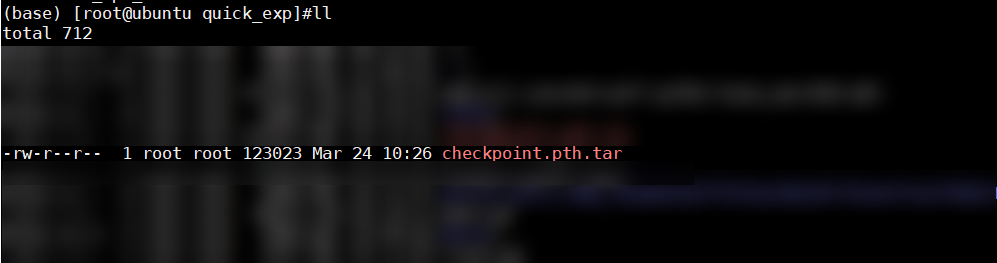

# 快速入门

## 环境准备

本快速入门以在Atlas 800T A2 训练服务器上运行为例。

-   驱动和固件、CANN软件安装请参考《[CANN 软件安装指南](https://www.hiascend.com/document/detail/zh/canncommercial/850/softwareinst/instg/instg_0000.html)》（商用版）或《[CANN 软件安装指南](https://www.hiascend.com/document/detail/zh/CANNCommunityEdition/850/softwareinst/instg/instg_0000.html)》（社区版）：
    -   安装方式：选择“在物理机上安装”
    -   安装类型：选择“离线安装”
    -   操作系统：选择可用的操作系统（兼容性请参考[兼容性查询助手](https://www.hiascend.com/hardware/compatibility)）
 

-   安装PyTorch框架及torch\_npu插件请参见《[Ascend Extension for PyTorch 软件安装指南](../installation_guide/installation_description.md)》。

## 模型迁移训练

本节提供了一个简单的模型迁移样例，采用了最简单的自动迁移方法，帮助用户快速体验GPU模型脚本迁移到昇腾NPU上的流程。基于CNN模型识别手写数字的脚本，对在GPU上训练的该脚本代码进行修改，使其可以迁移到昇腾NPU上进行训练。

1.  新建脚本train.py，写入以下原GPU脚本代码。

    ```python
    # 引入模块
    import time
    import torch
    import torch.nn as nn
    from torch.utils.data import Dataset, DataLoader
    import torchvision
    
    # 初始化运行device
    device = torch.device('cuda:0')   
    
    # 定义模型网络
    class CNN(nn.Module):
        def __init__(self):
            super(CNN, self).__init__()
            self.net = nn.Sequential(
                # 卷积层
                nn.Conv2d(in_channels=1, out_channels=16,
                          kernel_size=(3, 3),
                          stride=(1, 1),
                          padding=1),
                # 池化层
                nn.MaxPool2d(kernel_size=2),
                # 卷积层
                nn.Conv2d(16, 32, 3, 1, 1),
                # 池化层
                nn.MaxPool2d(2),
                # 将多维输入一维化
                nn.Flatten(),
                nn.Linear(32*7*7, 16),
                # 激活函数
                nn.ReLU(),
                nn.Linear(16, 10)
            )
        def forward(self, x):
            return self.net(x)
    
    # 下载数据集
    train_data = torchvision.datasets.MNIST(
        root='mnist',
        download=True,
        train=True,
        transform=torchvision.transforms.ToTensor()
    )
    
    # 定义训练相关参数
    batch_size = 64   
    model = CNN().to(device)  # 定义模型
    train_dataloader = DataLoader(train_data, batch_size=batch_size)    # 定义DataLoader
    loss_func = nn.CrossEntropyLoss().to(device)    # 定义损失函数
    optimizer = torch.optim.SGD(model.parameters(), lr=0.1)    # 定义优化器
    epochs = 10  # 设置循环次数
    
    # 设置循环
    for epoch in range(epochs):
        for imgs, labels in train_dataloader:
            start_time = time.time()    # 记录训练开始时间
            imgs = imgs.to(device)    # 把img数据放到指定NPU上
            labels = labels.to(device)    # 把label数据放到指定NPU上
            outputs = model(imgs)    # 前向计算
            loss = loss_func(outputs, labels)    # 损失函数计算
            optimizer.zero_grad()
            loss.backward()    # 损失函数反向计算
            optimizer.step()    # 更新优化器
    
    # 定义保存模型
    torch.save({
                   'epoch': 10,
                   'arch': CNN,
                   'state_dict': model.state_dict(),
                   'optimizer' : optimizer.state_dict(),
                },'checkpoint.pth.tar')
    ```

2.  在train.py中添加以下代码。

    -   若用户使用<term>Atlas 训练系列产品</term>，则在迁移完成、训练开始之前，由于其架构特性需要，用户需要开启混合精度。
    -   若用户使用<term>Atlas A2 训练系列产品</term>或<term>Atlas A3 训练系列产品</term>，则可以自行选择是否开启混合精度。

    > [!NOTE]  
    > 具体介绍可参见《PyTorch 训练模型迁移调优指南》中的“[混合精度适配](https://www.hiascend.com/document/detail/zh/Pytorch/730/ptmoddevg/trainingmigrguide/PT_LMTMOG_0026.html)”章节。

    ```diff
        import time
        import torch
        ......
    +   import torch_npu
    +   from torch_npu.npu import amp # 导入AMP模块
    +   from torch_npu.contrib import transfer_to_npu    # 使能自动迁移
    ```

    若未使能自动迁移，用户可参考《PyTorch 训练模型迁移调优指南》中的“[手工迁移](https://www.hiascend.com/document/detail/zh/Pytorch/730/ptmoddevg/trainingmigrguide/PT_LMTMOG_0016.html)”章节进行相关操作。

3.  使能AMP混合精度计算。若用户使用<term>Atlas A2 训练系列产品</term>或<term>Atlas A3 训练系列产品</term>，则可以选择跳过此步骤。

    在模型、优化器定义之后，定义AMP功能中的GradScaler。

    ```python
    ......
    loss_func = nn.CrossEntropyLoss().to(device)    # 定义损失函数
    optimizer = torch.optim.SGD(model.parameters(), lr=0.1)    # 定义优化器
    scaler = amp.GradScaler()    # 在模型、优化器定义之后，定义GradScaler
    epochs = 10
    ```

    删除以下原GPU脚本代码。

    ```diff
    ......
    for epoch in range(epochs):
        for imgs, labels in train_dataloader:
            start_time = time.time()    # 记录训练开始时间
            imgs = imgs.to(device)    # 把img数据放到指定NPU上
            labels = labels.to(device)    # 把label数据放到指定NPU上
            outputs = model(imgs)    # 前向计算
            loss = loss_func(outputs, labels)    # 损失函数计算
            optimizer.zero_grad()
    -       loss.backward()    # 损失函数反向计算
    -       optimizer.step()    # 更新优化器
    ```

    添加以下代码开启AMP。

    ```diff
    ......
    for i in range(epochs):
        for imgs, labels in train_dataloader:
            imgs = imgs.to(device)
            labels = labels.to(device)
    +        with amp.autocast():
                outputs = model(imgs)    # 前向计算
                loss = loss_func(outputs, labels)    # 损失函数计算
            optimizer.zero_grad()
    +        # 进行反向传播前后的loss缩放、参数更新
    +        scaler.scale(loss).backward()    # loss缩放并反向传播
    +        scaler.step(optimizer)    # 更新参数（自动unscaling）
    +        scaler.update()    # 基于动态Loss Scale更新loss_scaling系数
    ```

4.  执行命令启动训练脚本（命令脚本名称可根据实际修改）。

    ```
    python3 train.py
    ```

    训练结束后生成如下图权重文件，则说明迁移训练成功。

    

## 进阶开发

-   如果您想体验PyTorch模型训练迁移更丰富的功能，请前往《[PyTorch 训练模型迁移调优指南](https://www.hiascend.com/document/detail/zh/Pytorch/730/ptmoddevg/trainingmigrguide/PT_LMTMOG_0002.html)》文档阅读了解。
-   如果您想体验大模型训练更丰富的功能，请参见[表1](#模型迁移指导)了解。

    **表 1**  模型迁移指导<a id="模型迁移指导"></a>    

    |大模型|组件|迁移指导|
    |--|--|--|
    |Megatron-LM分布式大模型|MindSpeed Core亲和加速模块|请参见《[分布式训练加速库迁移指南](https://gitcode.com/Ascend/MindSpeed/blob/master/docs/user-guide/model-migration.md)》。|
    |Megatron-LM大语言模型|MindSpeed LLM套件|请参见《[MindSpeed LLM用户使用手册](https://gitcode.com/Ascend/MindSpeed-LLM/wiki/Home.md)》中的“MindSpeed LLM迁移指南（PyTorch框架）”章节。|
    |Megatron-LM多模态模型|MindSpeed MM套件|请参见《[MindSpeed MM迁移调优指南](https://gitcode.com/Ascend/MindSpeed-MM/blob/master/docs/user-guide/model-migration.md)》。|
    |大语言模型或多模态模型|MindSpeed RL套件|请参见《[MindSpeed RL使用指南](https://gitcode.com/Ascend/MindSpeed-RL/tree/master/docs/solutions)》。|
