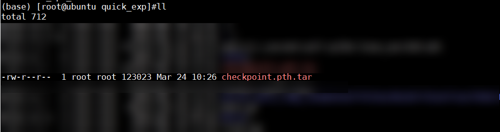

# 快速入门

## 环境准备

本例以Atlas 800T A2训练服务器为例。

请先完成以下安装及环境配置；已完成的可直接进入数据准备。

- NPU驱动固件和CANN：参见《[CANN 软件安装](https://www.hiascend.com/document/detail/zh/canncommercial/900/softwareinst/instg/instg_0000.html?OS=openEuler&InstallType=netyum)》（商用版）或《[CANN 软件安装](https://www.hiascend.com/document/detail/zh/CANNCommunityEdition/900/softwareinst/instg/instg_0000.html?OS=openEuler&InstallType=netyum)》（社区版），并按指南加载环境变量。
- PyTorch框架及torch_npu插件：参见《[Ascend Extension for PyTorch 软件安装指南](../installation_guide/installation_description.md)》。
- torchvision：请安装与PyTorch版本配套的CPU版本，参见[安装torchvision](../installation_guide/installing_torchvision.md)。

## 数据准备

本例使用MNIST手写数字数据集。首次运行时，脚本通过`download=True`下载数据，需要能够访问数据集下载站点。数据保存在当前工作目录下的`mnist/MNIST/raw/`中；数据已完整下载后，后续运行会复用本地数据。

若训练服务器无法联网，可先在已安装torchvision的联网环境中执行以下命令，再将生成的整个`mnist`目录复制到训练服务器运行脚本的工作目录下，并将训练脚本中的`download=True`改为`download=False`。

```bash
python3 -c "from torchvision.datasets import MNIST; MNIST(root='mnist', train=True, download=True)"
```

## 模型迁移训练

本节以CNN模型识别MNIST手写数字为例，演示如何通过自动迁移，将GPU训练脚本迁移到昇腾NPU上运行。请先完成步骤1～3中的适用修改，再执行步骤4。是否开启混合精度，请根据步骤3中的硬件适用说明选择。

> [!NOTE]
>
> 下文`diff`代码块中的`+`表示新增行，`-`表示删除行，`...`表示省略的原有代码。这些标记用于说明修改位置，不应写入`train.py`。普通`python`代码块可直接复制，请保留代码缩进。

1. 新建脚本train.py，写入以下原GPU脚本代码。

    ```python
    # 引入模块
    import torch
    import torch.nn as nn
    from torch.utils.data import DataLoader
    import torchvision
    
    # 初始化运行device
    device = torch.device('cuda:0')   
    
    # 定义模型网络
    class CNN(nn.Module):
        def __init__(self):
            super(CNN, self).__init__()
            self.net = nn.Sequential(
                # 卷积层
                nn.Conv2d(in_channels=1, out_channels=16,
                          kernel_size=(3, 3),
                          stride=(1, 1),
                          padding=1),
                # 池化层
                nn.MaxPool2d(kernel_size=2),
                # 卷积层
                nn.Conv2d(16, 32, 3, 1, 1),
                # 池化层
                nn.MaxPool2d(2),
                # 将多维输入一维化
                nn.Flatten(),
                nn.Linear(32*7*7, 16),
                # 激活函数
                nn.ReLU(),
                nn.Linear(16, 10)
            )
        def forward(self, x):
            return self.net(x)
    
    # 下载数据集
    train_data = torchvision.datasets.MNIST(
        root='mnist',
        download=True,
        train=True,
        transform=torchvision.transforms.ToTensor()
    )
    
    # 定义训练相关参数
    batch_size = 64   
    model = CNN().to(device)  # 定义模型
    train_dataloader = DataLoader(train_data, batch_size=batch_size)    # 定义DataLoader
    loss_func = nn.CrossEntropyLoss().to(device)    # 定义损失函数
    optimizer = torch.optim.SGD(model.parameters(), lr=0.1)    # 定义优化器
    epochs = 10  # 设置循环次数
    
    # 设置循环
    for epoch in range(epochs):
        for step, (imgs, labels) in enumerate(train_dataloader, start=1):
            imgs = imgs.to(device)    # 把图像数据放到指定设备上
            labels = labels.to(device)    # 把标签数据放到指定设备上
            outputs = model(imgs)    # 前向计算
            loss = loss_func(outputs, labels)    # 损失函数计算
            optimizer.zero_grad()
            loss.backward()    # 损失函数反向计算
            optimizer.step()    # 更新优化器
            if step % 100 == 0 or step == len(train_dataloader):
                print(f"Epoch [{epoch + 1}/{epochs}], Step [{step}/{len(train_dataloader)}], Loss: {loss.item():.4f}")
    
    # 保存模型检查点
    torch.save({
                   'epoch': epochs,
                   'arch': CNN,
                   'state_dict': model.state_dict(),
                   'optimizer' : optimizer.state_dict(),
                },'checkpoint.pth.tar')
    print("Training completed. Checkpoint saved to checkpoint.pth.tar")
    ```

2. 在`train.py`顶部的导入区域添加以下代码，确保它们位于`device = torch.device('cuda:0')`之前。

    ```diff
     import torch
     import torch.nn as nn
     from torch.utils.data import DataLoader
     import torchvision
    +import torch_npu
    +from torch_npu.contrib import transfer_to_npu    # 开启自动迁移
    ```

    导入`transfer_to_npu`即开启自动迁移，将本例中的相关CUDA调用映射到NPU。因此，脚本中的`cuda:0`可以保留，模型和数据实际在NPU上运行。若未开启自动迁移，用户可参考[手工迁移](https://gitcode.com/Ascend/docs/blob/master/FrameworkPTAdapter/26.0.0/zh/pytorch_model_migration_fine_tuning/manual_migration.md)进行相关操作。

3. 在train.py中添加以下代码开启AMP混合精度。

    > [!NOTE]
    >
    > - 若用户使用<term>Atlas 训练系列产品</term>，则在迁移完成、训练开始之前，由于其架构特性，用户需要执行此步骤开启混合精度。
    > - 若用户使用<term>Atlas A2 训练系列产品</term>、<term>Atlas A3 训练系列产品</term>或<term>Ascend 950DT</term>，则可以自行选择是否开启混合精度，如果选择不开启混合精度，则可以跳过此步骤。
    > - 混合精度的具体介绍，请参见[混合精度适配](https://gitcode.com/Ascend/docs/blob/master/FrameworkPTAdapter/26.0.0/zh/pytorch_model_migration_fine_tuning/adaptation_introduction.md)。

    AMP（自动混合精度）包含两个主要操作：`autocast`为前向计算中的算子选择适用的计算精度；`GradScaler`通过缩放loss减少低精度梯度下溢的风险，并在参数更新时还原梯度尺度。

    在导入区域添加AMP模块，并在模型、优化器定义之后、训练循环之前定义`GradScaler`：

    ```diff
     import torch_npu
    +from torch_npu.npu import amp
     from torch_npu.contrib import transfer_to_npu
     ...
     loss_func = nn.CrossEntropyLoss().to(device)    # 定义损失函数
     optimizer = torch.optim.SGD(model.parameters(), lr=0.1)    # 定义优化器
    +scaler = amp.GradScaler()    # 定义GradScaler
     epochs = 10
    ```

    将步骤1中从`for epoch in range(epochs):`开始的整个训练循环替换为以下代码，循环之后的模型保存代码保持在原位置。注意，前向计算和loss计算均放在`with amp.autocast():`内部，反向传播在其外部执行。

    ```python
    for epoch in range(epochs):
        for step, (imgs, labels) in enumerate(train_dataloader, start=1):
            imgs = imgs.to(device)
            labels = labels.to(device)
            with amp.autocast():
                outputs = model(imgs)    # 前向计算
                loss = loss_func(outputs, labels)    # 损失函数计算
            optimizer.zero_grad()
            scaler.scale(loss).backward()    # 缩放loss并反向传播
            scaler.step(optimizer)    # 还原梯度尺度并更新参数；梯度非有限时跳过更新
            scaler.update()    # 动态更新缩放系数
            if step % 100 == 0 or step == len(train_dataloader):
                print(f"Epoch [{epoch + 1}/{epochs}], Step [{step}/{len(train_dataloader)}], Loss: {loss.item():.4f}")
    ```

4. 在`train.py`所在目录执行以下命令启动训练。首次体验时，可将`epochs = 10`改为`epochs = 1`，先验证一轮训练流程。

    ```bash
    python3 train.py
    ```

    训练过程中，每100个batch及每轮最后一个batch打印一次当前轮次、训练步数和loss，便于观察训练进度。其中，loss为当前batch的损失值。

    使用默认参数时，日志格式如下（loss数值仅为示意，实际结果会随运行变化）：

    ```text
    Epoch [1/10], Step [100/938], Loss: 0.4123
    Epoch [1/10], Step [200/938], Loss: 0.2856
    ...
    Epoch [10/10], Step [938/938], Loss: 0.0732
    Training completed. Checkpoint saved to checkpoint.pth.tar
    ```

    loss可能随batch波动，不要求逐次下降。若出现`nan`或`inf`，应检查数据、学习率及混合精度配置。

    本次训练正常结束、输出保存完成提示，并在当前工作目录生成或更新`checkpoint.pth.tar`，说明本例的迁移训练流程已跑通。该文件包含模型参数、优化器状态和训练轮数等信息；请结合本次运行的日志和文件修改时间判断，避免将旧文件误认为本次结果。模型识别效果还需通过独立测试集评估，本例未包含评估步骤。

    

## 进阶开发

- 如果您想体验PyTorch模型训练迁移更丰富的功能，请前往《[PyTorch 训练模型迁移调优指南](https://gitcode.com/Ascend/docs/blob/master/FrameworkPTAdapter/26.0.0/zh/pytorch_model_migration_fine_tuning/overview.md)》文档阅读了解。
- 如果您想体验大模型训练更丰富的功能，请参见[表1](#模型迁移指导)。

    **表 1**  模型迁移指导<a id="模型迁移指导"></a>    

    |大模型|组件|迁移指导|
    |--|--|--|
    |Megatron-LM分布式大模型|MindSpeed Core亲和加速模块|请参见《[分布式训练加速库迁移指南](https://gitcode.com/Ascend/MindSpeed/blob/26.0.0_core_r0.12.1/docs/zh/user-guide/model-migration.md)》。|
    |Megatron-LM大语言模型|MindSpeed LLM套件|请参见《[MindSpeed LLM文档导读](https://gitcode.com/Ascend/MindSpeed-LLM/blob/26.0.0/docs/zh/docs_guide.md)》。|
    |Megatron-LM多模态模型|MindSpeed MM套件|请参见《[MindSpeed MM迁移调优指南](https://gitcode.com/Ascend/MindSpeed-MM/blob/26.0.0/docs/zh/pytorch/model-migration.md)》。|
    |大语言模型或多模态模型|MindSpeed RL套件|请参见《[MindSpeed RL使用指南](https://gitcode.com/Ascend/MindSpeed-RL/tree/master/docs/zh/solutions)》。|
