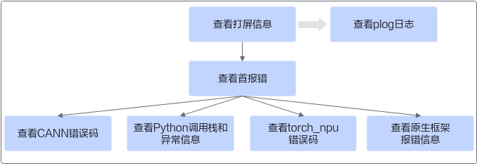

# 报错信息分析

## 分析流程

获取报错信息后可参考以下流程进行自助式问题分析，以便开发者快速定位并解决故障。

**图 1**  报错信息分析流程  


1.  查看屏幕打印的错误信息，先查看首报错，再进一步根据具体信息分类进行查看，最后分析故障原因。
2.  如果回显信息无法最终确定故障发生原因，可继续查看plog日志协助分析。

## 分析示例

本节以下图回显信息为例，介绍如何进行报错信息分析。

**图 2**  回显信息示例  


1.  查看回显信息中的首报错。

    ```ColdFusion
    EZ3002: 2024-11-05-22:31:29.035.909 Optype [%s] of Ops kernel [%s] is unsupported. Reason: %s.
    ```

    “EZ3002”即为CANN软件错误码，用户可根据对应错误码信息进行故障分析，如仍不明确问题来源，可进一步查看其他回显信息。

2.  查看Python调用栈和异常信息。

    **图 3**  Python调用栈  
    

    屏幕中显示先调用`torch_npu.npu.synchronize()`，继而调用`torch_npu._C._npu_synchronize()`失败。异常信息显示报错时正在运行的算子是ReduceAny，可据此找到对应异常组件，如果没有明确错误指向，需继续查看后续调用。

3.  查看torch\_npu错误码。

    ```ColdFusion
    ERR00100 PTA call acl api failed
    ```

    “ERR00100”即为torch\_npu错误码，如果有明确错误指向，可根据具体故障原因清除故障。

4.  另外此处表明torch\_npu调用底层接口报错，还可以查看plog日志，根据日志中的首报错分析故障原因。

    **图 4**  plog日志中查找报错组件  
    

    上述打印信息中的报错组件为ASCENDCL，报错信息为算子DynamicGRUV2，可据此找到对应异常组件，如果仍然不能根据报错信息明确故障组件，可联系华为技术支持获取帮助。

> [!NOTE]  
> 如果回显信息出现原生框架报错，请根据报错信息指向进行解决，如果涉及昇腾相关，可查看除此之外的昇腾首报错信息。

