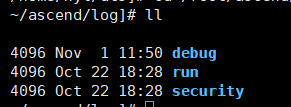
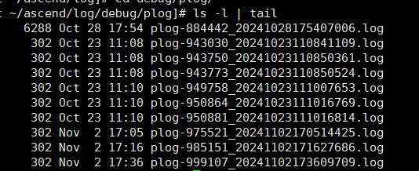

# plog日志信息

应用程序运行完成后，默认可在“$HOME/ascend/log”下查看其应用类日志，如下图所示。

**图 1**  应用类日志  

其中，plog日志可在“$HOME/ascend/log/debug/plog”下查看，如下图所示。该路径下存放了Host侧运行应用程序产生的调试日志，主要包括compiler中各组件（如GE、FE、AI CPU、TBE、HCCL等）、Runtime中各组件（如AscendCL、GE、Runtime等）、AI框架（如torch\_npu）和Driver用户态日志。

**图 2**  获取plog日志  

如[图3](#plog日志示例_HCCL)所示，用户可以从中查看日志级别（例如“ERROR“）和产生日志的模块名称（例如“HCCL“）。

**图 3**  plog日志示例（HCCL）  

**图 4**  plog日志示例（底层报错OOM）  

> [!NOTE]  
> 更多日志详细介绍可参见《[CANN 日志参考](https://www.hiascend.com/document/detail/zh/canncommercial/83RC1/maintenref/logreference/logreference_0001.html)》。

