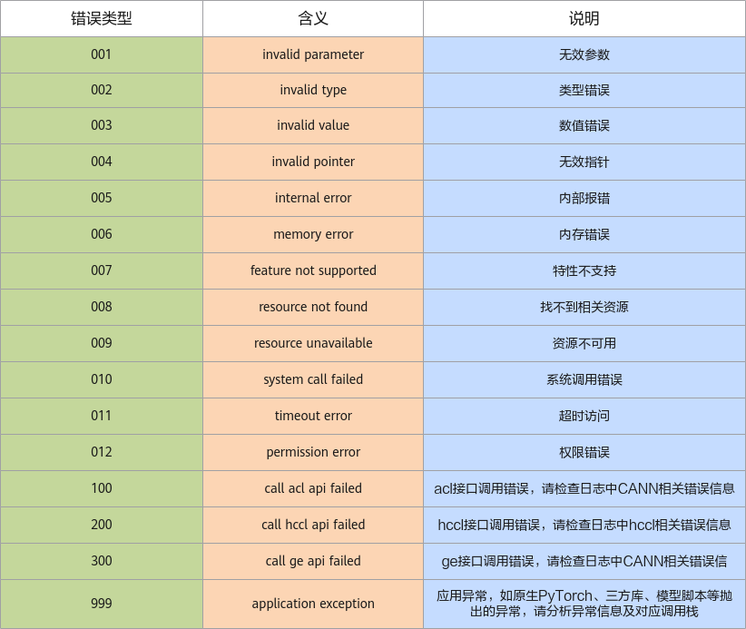

# 使用说明

## 产生机制

用户执行模型构建、推理运行、训练脚本等场景时发生异常错误，例如检查到输入错误（命令行输入参数错误、API输入参数错误、输入文件错误、算子不支持、Shape/Format不支持……）、环境错误，在用户界面展示报错的错误码信息。实际问题定位中，需要结合具体的报错信息以及plog日志等共同定位。

## 错误码展示方式说明

> [!NOTE]  
> 一般情况下，ERR\*\*005表示内部错误，内部错误可联系华为进行故障排查，您可以到[昇腾社区](https://gitcode.com/Ascend/pytorch/issues)提交issue获取帮助。  
> 本文介绍的错误码相关信息已在屏显报错时全部展示，包括可能的原因、解决方案等，因此，本处仅将相关内容罗列供参考。

由于场景不同、用例不同、发生故障的原因不同，造成打印的错误码信息有区别，因此，本文中以\[%s\]变量形式替代实际的打印日志，\[%s\]替代的实际日志以屏幕打印为准。

例如ERR00002错误码在手册中的表示形式为：

\[ERROR\] \[%s\] \(PID:\[%s\], Device:\[%s\], RankID:\[%s\]\) ERR\[%s\]\[%s\] \[%s\] \[%s\]

用户界面实际报错示例如下所示，报错信息由五部分组成，具体可参考[表1](#报错信息详细说明)。

```ColdFusion
[ERROR] 2024-03-07-01:31:48 (PID:116072, Device:0, RankID:-1) ERR00002 PTA invalid type
```

**表 1**  报错信息详细说明<a id="报错信息详细说明"></a>  

|报错信息|说明|
|:---|:---|
|日志级别|示例：[ERROR]。|
|日志打印时间戳|示例：2024-03-07-01:31:48。|
|设备信息|示例：(PID:116072, Device:0, RankID:-1)。<br>- PID：报错进程的进程号信息。<br>- Device：报错进程所在的设备号，通过ACL接口获取，若获取失败，则打印缺省值-1。<br>- RankID：报错进程所在的设备在通信域中的序号，通过环境变量RANK获取，若未配置，则打印缺省值-1。|
|错误码|示例：ERR00002。<br>错误码以8位字符形式体现，各字段释义可参考[图1](#各字段释义)：<br>- 字段1为ERR，表示错误类。<br>- 字段2为两位数字，表示错误模块，具体含义可参考[图2](#字段2含义)。<br>- 字段3为三位数字，表示错误类型，具体含义可参考[图3](#字段3含义)。|
|错误码释义|示例：PTA invalid type。|


**图 1**  各字段释义<a id="各字段释义"></a>  


**图 2**  字段2含义<a id="字段2含义"></a>  


**图 3**  字段3含义<a id="字段3含义"></a>  


