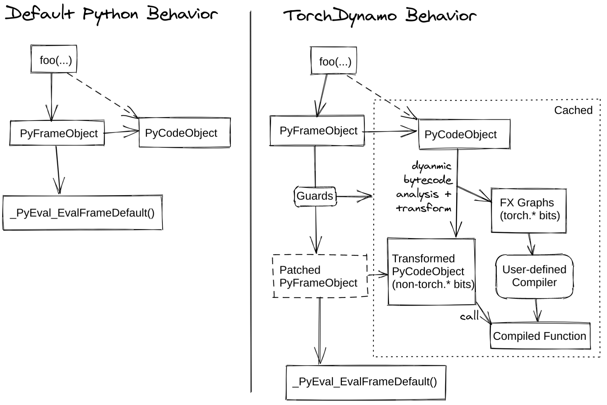
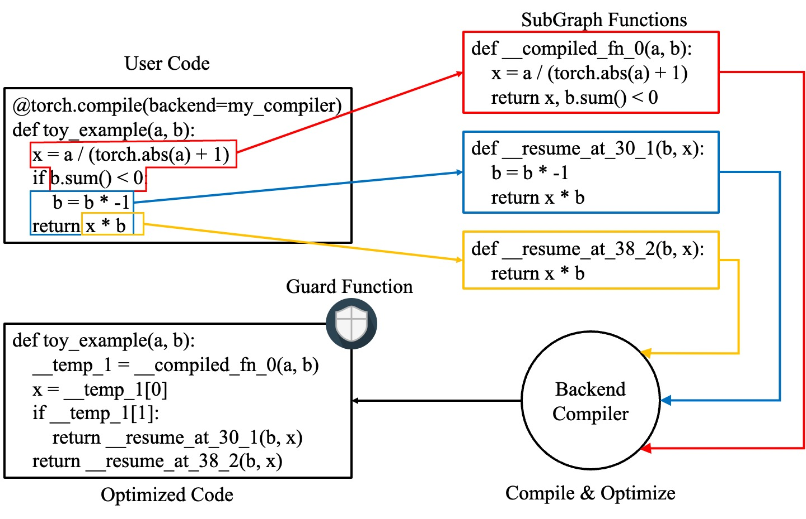

# Dynamo概述

本文档内容与原生文档保持一致，原生社区文档详见[原生文档](https://docs.pytorch.org/docs/2.13/user_guide/torch_compiler/torch.compiler_dynamo_overview.html)。

阅读本节之前，请先阅读[torch.compiler](../_menu_torch_compile.md)。

TorchDynamo（简称Dynamo）是一个Python级即时（JIT）编译器，旨在加速未经修改的PyTorch程序。Dynamo挂接到CPython的frame求值API（[PEP 523](https://peps.python.org/pep-0523/)），在Python字节码执行前动态修改它。它重写Python字节码，将PyTorch操作序列提取到[FX图](https://pytorch.org/docs/stable/fx.html)中，再由可自定义后端编译。Dynamo通过字节码分析创建FX图，并将Python执行与编译后端相结合，兼顾易用性和性能。

Dynamo使尝试不同编译器后端来加速PyTorch代码变得十分容易，只需使用单行装饰器`torch._dynamo.optimize()`；`torch.compile()`对它进行了便捷封装。

**图 1** PyTorch使用和不使用torch.compile时的工作方式



`TorchInductor`是受支持的后端之一，它将[Dynamo图](https://pytorch.org/docs/stable/fx.html)转换为用于NPU的[Triton](https://github.com/triton-lang/triton)或用于CPU的[C++/OpenMP](https://www.openmp.org/)。[训练性能看板](https://hud.pytorch.org/benchmark/compilers)提供了不同训练后端的性能对比。有关详细信息，请阅读PyTorch dev-discuss上的[TorchInductor帖子](https://dev-discuss.pytorch.org/t/torchinductor-a-pytorch-native-compiler-with-define-by-run-ir-and-symbolic-shapes/747)。

如需深入了解，请阅读以下章节、观看深度解析视频并查阅dev-discuss相关主题。

- [Dynamo深度解析视频](https://www.youtube.com/watch?v=egZB5Uxki0I)
- [dev-discuss主题](https://dev-discuss.pytorch.org/search?q=TorchDynamo%20order%3Alatest)

## Dynamo内部机制

本节介绍Dynamo的部分内部机制，并展示Dynamo的底层工作方式。

### guard概述

Dynamo以即时方式运行，并根据动态属性对图进行特化。下面是使用Dynamo的基本示例。可以使用`torch.compile`装饰函数或方法来启用Dynamo优化：

```python
from typing import List
import torch
def my_compiler(gm: torch.fx.GraphModule, example_inputs: List[torch.Tensor]):
    print("my_compiler() called with FX graph:")
    gm.graph.print_tabular()
    return gm.forward  # return a python callable

@torch.compile(backend=my_compiler)
def toy_example(a, b):
    x = a / (torch.abs(a) + 1)
    if b.sum() < 0:
        b = b * -1
    return x * b
for _ in range(100):
    toy_example(torch.randn(10), torch.randn(10))
```

例如，上述第一个图具有以下guard：

```text
GUARDS:
hasattr(L['a'], '_dynamo_dynamic_indices') == False
hasattr(L['b'], '_dynamo_dynamic_indices') == False
utils_device.CURRENT_DEVICE == None
___skip_backend_check() or ___current_backend() == ___lookup_backend(140355900538256)
check_tensor(L['a'], Tensor, DispatchKeySet(CPU, BackendSelect, ADInplaceOrView, AutogradCPU), torch.float32, device=None, requires_grad=False, size=[10], stride=[1])
check_tensor(L['b'], Tensor, DispatchKeySet(CPU, BackendSelect, ADInplaceOrView, AutogradCPU), torch.float32, device=None, requires_grad=False, size=[10], stride=[1])
```

如果任意一个guard失败，系统会重新捕获并编译该图。其中值得关注的是`check_tensor`，它检查以下`torch.Tensor`属性：

- Tensor的Python类（Tensor子类等）
- dtype
- device
- requires_grad
- dispatch_key (with thread-local includes/excludes applied)
- ndim
- sizes\*
- strides\*

完全特化模式允许后端编译器假设计算图完全静态。遗憾的是，大多数后端都要求如此。未启用动态形状模式时，返回动态形状的算子会触发图断裂。

### Dynamo的主要工作

如果需要进一步了解Dynamo的行为，可以使用以下命令运行代码：

```bash
TORCH_LOGS="+dynamo,guards,bytecode"
```

如果不熟悉Python字节码，可添加反编译器hook，将字节码反编译为可读的源代码。推荐使用depyf工具，若未安装，请先执行pip install depyf，随后在运行任何代码前插入以下语句以启用反编译Hook。

```python
import depyf
depyf.install()
```

此代码会触发有用（但数量很多）的打印输出。

例如，`toy_example`中第一个图的打印输出如下：

```text
__compiled_fn_0 <eval_with_key>.1
opcode         name     target                                                  args              kwargs
-------------  -------  ------------------------------------------------------  ----------------  --------
placeholder    a        a                                                       ()                {}
placeholder    b        b                                                       ()                {}
call_function  abs_1    <built-in method abs of type object at 0x7f9ca082f8a0>  (a,)              {}
call_function  add      <built-in function add>                                 (abs_1, 1)        {}
call_function  truediv  <built-in function truediv>                             (a, add)          {}
call_method    sum_1    sum                                                     (b,)              {}
call_function  lt       <built-in function lt>                                  (sum_1, 0)        {}
output         output   output                                                  ((truediv, lt),)  {}
ORIGINAL BYTECODE toy_example example.py line 12
 14           0 LOAD_FAST                0 (a)
              2 LOAD_GLOBAL              0 (torch)
              4 LOAD_METHOD              1 (abs)
              6 LOAD_FAST                0 (a)
              8 CALL_METHOD              1
             10 LOAD_CONST               1 (1)
             12 BINARY_ADD
             14 BINARY_TRUE_DIVIDE
             16 STORE_FAST               2 (x)
 15          18 LOAD_FAST                1 (b)
             20 LOAD_METHOD              2 (sum)
             22 CALL_METHOD              0
             24 LOAD_CONST               2 (0)
             26 COMPARE_OP               0 (<)
             28 POP_JUMP_IF_FALSE       19 (to 38)
 16          30 LOAD_FAST                1 (b)
             32 LOAD_CONST               3 (-1)
             34 BINARY_MULTIPLY
             36 STORE_FAST               1 (b)
 17     >>   38 LOAD_FAST                2 (x)
             40 LOAD_FAST                1 (b)
             42 BINARY_MULTIPLY
             44 RETURN_VALUE
MODIFIED BYTECODE toy_example example.py line 12
 12           0 LOAD_GLOBAL              3 (__compiled_fn_0)
              2 LOAD_FAST                0 (a)
              4 LOAD_FAST                1 (b)
              6 CALL_FUNCTION            2
              8 UNPACK_SEQUENCE          2
             10 STORE_FAST               2 (x)
             12 POP_JUMP_IF_FALSE       12 (to 24)
             14 LOAD_GLOBAL              4 (__resume_at_30_1)
             16 LOAD_FAST                1 (b)
             18 LOAD_FAST                2 (x)
             20 CALL_FUNCTION            2
             22 RETURN_VALUE
        >>   24 LOAD_GLOBAL              5 (__resume_at_38_2)
             26 LOAD_FAST                1 (b)
             28 LOAD_FAST                2 (x)
             30 CALL_FUNCTION            2
             32 RETURN_VALUE
possible source code:
def toy_example(a, b):
    __temp_1 = __compiled_fn_0(a, b)
    x = __temp_1[0]
    if __temp_1[1]:
        return __resume_at_30_1(b, x)
    return __resume_at_38_2(b, x)
如果发现反编译代码有误，请提交[issues](https://github.com/youkaichao/depyf/issues)进行反馈。
```

顶部是FX图。之后依次是函数的原始字节码、Dynamo生成的修改后字节码，以及供参考的反编译源代码。最后是上文介绍的guard。

在修改后的字节码中，`__compiled_fn_0`是`my_compiler()`（已编译图）的返回值。`__resume_at_30_1`和`__resume_at_38_2`都是生成的continuation函数，会在图断裂后（字节码偏移量30和38处）继续执行。函数形式如下：

```text
__resume_at_<offset>:
    ... restore stack state if needed ...
    JUMP_ABSOLUTE <offset> into toy_example
    ... original bytecode of toy_example ...
```

生成此`resume_at`函数后，会强制函数的剩余部分在新的Python frame中执行。当执行首次到达该位置时，会递归触发Dynamo重新开始捕获。

### Dynamo生成产物及查看方法

可以使用API `torch._dynamo.eval_frame._debug_get_cache_entry_list`检查Dynamo生成的编译缓存。该API从函数的`__code__`对象中获取已编译代码和guard。一个已编译函数可以有多个缓存条目，每个条目都包含一个用于检查guard的生成函数，以及一个`types.CodeType`对象，用于保存满足guard条件时要执行的代码。

```python
from torch._dynamo.eval_frame import _debug_get_cache_entry_list, innermost_fn
cache_entries = _debug_get_cache_entry_list(innermost_fn(toy_example))
cache_entry = cache_entries[0]
guard, code = cache_entry.check_fn, cache_entry.code
# guard接收输入frame的局部变量，并判断是否应触发重编译。
import dis
dis.dis(guard)
dis.dis(code)
```

如果了解Python字节码，就可以理解上述输出。

对于guard函数，无需检查字节码，可以直接访问其guard条件：

```python
for code_part in guard.code_parts:
    print(code_part)
```

输出如下：

```text
___guarded_code.valid
___check_global_state()
hasattr(L['a'], '_dynamo_dynamic_indices') == False
hasattr(L['b'], '_dynamo_dynamic_indices') == False
utils_device.CURRENT_DEVICE == None
___skip_backend_check() or ___current_backend() == ___lookup_backend(140215810860528)
___check_tensors(L['a'], L['b'], tensor_check_names=tensor_check_names)
```

只有满足全部条件时，guard函数才会返回true，并执行已编译代码。

对于已编译代码，无法直接访问其源代码，必须进行反编译。

```python
from depyf import decompile
print(decompile(code))
```

输出如下：

```python
def toy_example(a, b):
    __temp_1 = __compiled_fn_0(a, b)
    x = __temp_1[0]
    if __temp_1[1]:
        return __resume_at_30_1(b, x)
    return __resume_at_38_2(b, x)
```

代码中引用的一些名称如下：

- 已编译函数：存储在包含原函数`toy_example`的模块全局命名空间中，例如`__compiled_fn_0`、`__resume_at_30_1`和`__resume_at_38_2`。
- 用于检查guard的闭包变量：可以从`guard.__code__.co_freevars`访问名称，值则存储在`guard.__closure__`中，例如`___guarded_code`、`___is_grad_enabled`、`___are_deterministic_algorithms_enabled`、`___is_torch_function_enabled`、`utils_device`、`___check_tensors`和`tensor_check_names`。
- `guard`函数的参数`L`：这是一个将`toy_example`参数名映射到其值的字典，仅在调用函数、frame求值API发挥作用时可用。简而言之，`L`是结构为`{'a': value_a, 'b': value_b}`的`dict`，因此代码使用`L['a']`引用输入变量`a`。

图断裂体现在已编译`toy_example`的代码中，此时必须使用Python解释器选择接下来要执行的图。

请注意，这里将简单的`my_compiler`函数作为后端编译器传入，因此子图代码`__resume_at_38_2`、`__resume_at_30_1`和`__compiled_fn_0`仍为Python代码。也可以检查这些代码（请忽略函数名，只关注函数签名和函数体代码）：

```python
print("source code of __compiled_fn_0:")
print(innermost_fn(__compiled_fn_0).__self__.code)
print("=" * 60)
print("source code of __resume_at_30_1:")
print(decompile(__resume_at_30_1))
print("=" * 60)
print("source code of __resume_at_38_2:")
print(decompile(__resume_at_38_2))
```

```text
source code of __compiled_fn_0:
def forward(self, L_a_ : torch.Tensor, L_b_ : torch.Tensor):
    l_a_ = L_a_
    l_b_ = L_b_
    abs_1 = torch.abs(l_a_)
    add = abs_1 + 1;  abs_1 = None
    truediv = l_a_ / add;  l_a_ = add = None
    sum_1 = l_b_.sum();  l_b_ = None
    lt = sum_1 < 0;  sum_1 = None
    return (truediv, lt)
# To see more debug info, please use ``graph_module.print_readable()``
============================================================
source code of __resume_at_30_1:
def <resume in toy_example>(b, x):
    b = b * -1
    return x * b
============================================================
source code of __resume_at_38_2:
def <resume in toy_example>(b, x):
    return x * b
```

综上，已编译代码在概念上等价于以下代码：

```python
def compiled_example(a, b):
    L = {'a': a, 'b': b}
    for guard, code in get_cache_entries():
        if guard(L):
            return code(a, b)
    recompile_and_add_another_cache_entry()
```

下图展示了`torch.compile`如何转换和优化用户编写的代码：它首先从用户编写的函数中提取计算图，将这些图编译为优化后的函数，再将它们组装成新函数。新函数在功能上与用户代码等价，但经过优化，具有良好的计算速度。

**图 2** torch.compile转换和优化用户代码的方式



有关这些功能的内部实现方式，请参考[Dynamo深度解析](https://docs.pytorch.org/docs/2.13/user_guide/torch_compiler/torch.compiler_dynamo_deepdive.html)。
