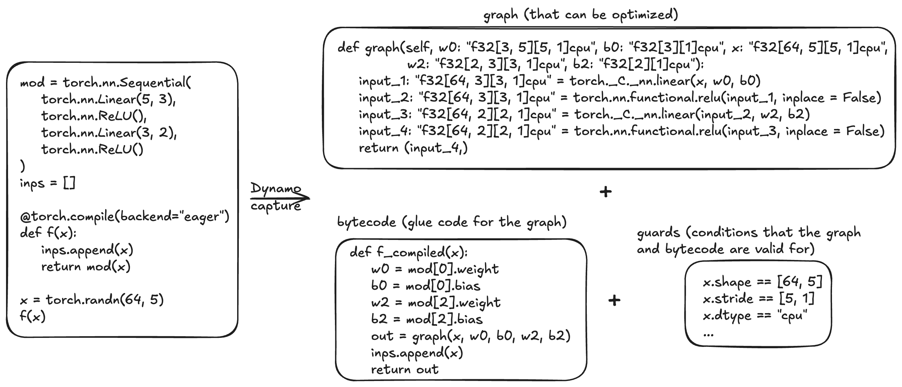

# Dynamo核心概念

**概要：**

- `torch.compile`的前端Dynamo通过**追踪**，将Python函数及其嵌套函数调用的语义捕获为线性操作序列（“FX图”）、残余字节码和“guard”（图和字节码有效时需满足的条件列表）。
- 不受支持的Python特性会导致**图断裂**：Dynamo编译追踪得到的部分图，运行不受支持的代码，然后恢复追踪。
- 图断裂可能降低`torch.compile`的速度，并阻碍后端优化。如果未获得预期性能，请检查图断裂。

## Dynamo追踪

`torch.compile`的前端Dynamo是一个自定义Python字节码解释器，旨在保留Python完整灵活性的同时支持PyTorch程序的图编译。对于待编译函数，Dynamo解释Python字节码，将PyTorch操作序列提取到一个或多个FX图中，以供后端进一步优化。

**图 1** Dynamo概要图



例如，对于上图中的函数`f`，Dynamo会生成：

- 一个**FX图**，接收原始输入以及函数所需的其他输入。
- 可直接替代`f`的**Python字节码**。在本例中，该字节码获取其他输入并将其传给计算图，同时包含无法优化的Python副作用（向列表追加元素）。
- 指定图和字节码有效条件的**guard**。除非另有说明，否则Dynamo生成的图会针对输入Tensor的形状进行特化。

## 图断裂

Dynamo会追踪代码，并尝试将PyTorch代码捕获到由PyTorch算子组成的单个计算图（FX图）中，但这并非总能实现。遇到无法追踪的代码时，就会发生“**图断裂**”。在`torch.compile`默认设置下，发生图断裂时会编译目前已经确定的FX图，以常规Python方式运行不受支持的代码，然后使用新的FX图从该代码之后恢复追踪。

图断裂是一项功能，使Dynamo能够处理任意Python代码，并从中划分出可分别优化的函数式子图。

但是，图断裂也可能导致`torch.compile`出现意外的性能下降。如果未获得预期的加速效果，建议检查并消除图断裂。

以下情况可能导致图断裂：

- 依赖数据的if语句
- 许多Python内置函数
- C函数

下面是调用不受支持的操作`print`而发生图断裂的示例：

```python
@torch.compile
def f(x):
   y = x ** 2  / 2
   print("graph break happened here")      # ← print会触发graph break
   z = y ** 3 / 6
   return z

x = torch.randn(3)
print(f(x))
```

`torch.compile(f)(x)`的语义大致如下：

```python
def compiled_f_semantics(x):
   y = torch.compile(g, fullgraph=True)(x)
   print("graph break happened here")
   z = torch.compile(h, fullgraph=True)(x)
   return z

def g(x):
    return x ** 2  / 2

def h(x):
    return y ** 3 / 6
```

## Guard

`torch.compile`在追踪代码时会对运行时值作出一些假设。追踪期间会生成“guard”，即针对这些假设的运行时检查。后续调用已编译函数时会运行guard，以确定能否复用之前编译的代码。运行时检查的示例包括常量值、类型和对象ID。

下面是生成guard的示例。`TENSOR_MATCH` guard会检查输入的类型、设备、dtype和形状等属性。

```python
@torch.compile
def fn(x):
    return x + 1

print(fn(torch.ones(3, 3)))
```

## 重编译

如果之前生成的所有已编译代码实例均未通过guard检查，`torch.compile`就必须“重新编译”函数，即再次追踪原始代码。在以下示例中，用于检查Tensor参数形状的guard未通过，因此需要重新编译。

```python
@torch.compile
def fn(x):
    return x + 1

print(fn(torch.ones(3, 3)))
print(fn(torch.ones(4, 4)))
```

## 动态形状

`torch.compile`最初会假设Tensor形状是静态的（常量），并基于这些假设设置guard。使用“动态形状”可以让`torch.compile`生成能够接受不同形状Tensor输入的已编译代码，避免每次形状变化时都重新编译。默认情况下，`torch.compile(dynamic=None)`会启用自动动态形状：如果因形状不匹配导致编译失败，系统会使用动态形状尝试重新编译。也可以完全启用（`dynamic=True`）或禁用（`dynamic=False`）动态形状。

下面启用动态形状。可以看到，此时不再需要重新编译。

```python
@torch.compile(dynamic=True)
def fn(x):
    return x + 1

print(fn(torch.ones(3, 3)))
print(fn(torch.ones(4, 4)))
```

有关动态形状的更多信息，请参考[动态形状手册](https://docs.google.com/document/d/1GgvOe7C8_NVOMLOCwDaYV1mXXyHMXY7ExoewHqooxrs/edit?tab=t.0#heading=h.fh8zzonyw8ng)。
