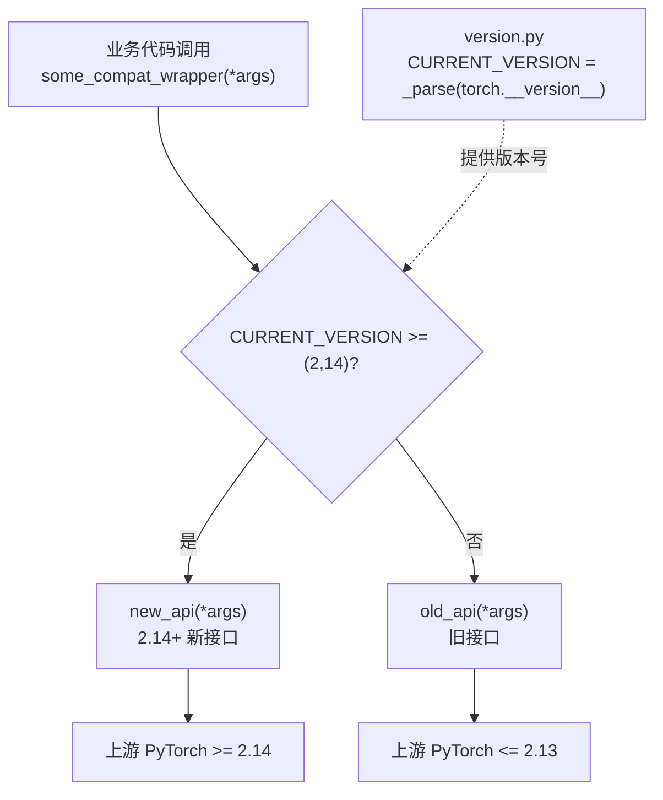
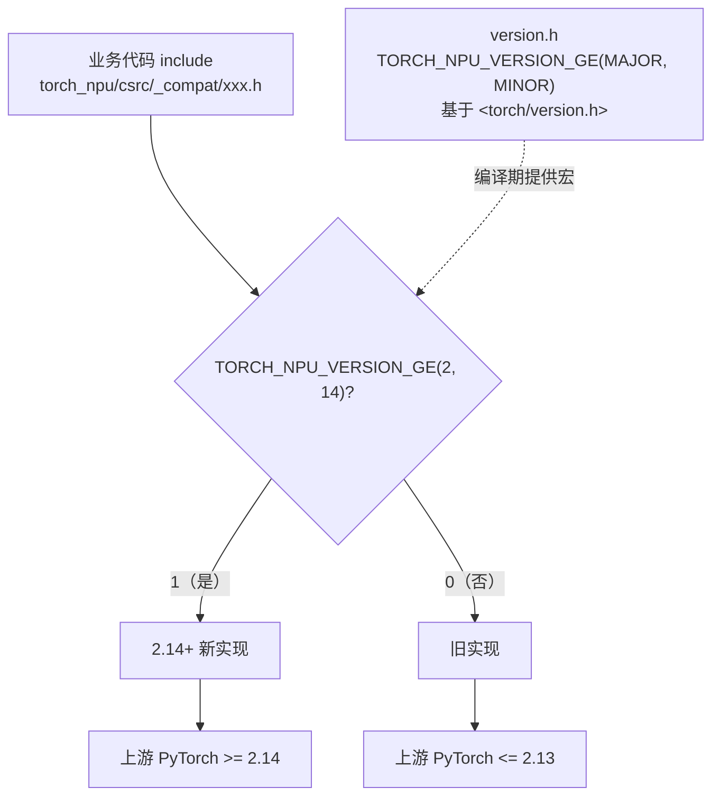

# torch version compatibility check工具

## 工具背景

torch_npu master用**一个代码分支**同时支持多个上游 PyTorch 版本（当前支持下限 2.13）。为了让业务代码不散落版本判断，所有版本差异都被隔离在统一的「兼容适配层」：

- **Python 侧**：`torch_npu/_compat/` 下的包装函数，运行时读取 `torch.__version__` 判断；
- **C++ 侧**：`torch_npu/csrc/_compat/` 下的头文件与编译期宏，构建时读取 `TORCH_VERSION_MAJOR / TORCH_VERSION_MINOR` 判断。

**核心原则：业务代码优先调用_compat层提供的统一接口/符号，不写版本判断。** 版本差异只存在于 `_compat` 层内。

### Python 侧方案

Python 兼容点都遵循「包装函数 + 运行时 if」模式：

1. 在 `_compat` 的某个模块里新增一个包装函数；
2. 函数内部用 `if CURRENT_VERSION >= (X, Y)` 走新/旧 API；
3. 业务代码只 `from torch_npu._compat.xxx import 包装函数` 并调用，不感知版本。

示例（以下为演示用的通用模式，`COMPAT(>= 2.14)` 仅示意）：



Python 侧标注规范（写在每个兼容块上方）：

```python
# COMPAT(>= 2.14): 上游某接口签名变化说明
# CAN REMOVE when MIN_SUPPORTED >= (2, 14): 直接用新接口
# 注：CAN REMOVE 是给维护者的文档提示，check_compat 工具不强制校验它。
def some_compat_wrapper(*args):
    if CURRENT_VERSION >= (2, 14):
        return new_api(*args)
    return old_api(*args)
```

### C++ 侧方案

C++ 兼容点遵循「头文件 + 编译期宏」模式：

1. `#include <torch_npu/csrc/_compat/version.h>`；
2. 在 `_compat` 头文件里用 `#if TORCH_NPU_VERSION_GE(X, Y)` 分出新旧实现；
3. 业务代码只 include 这个头文件、统一使用别名/函数，不写 `#if`。

示例（以下为演示用的通用模式，`TORCH_NPU_VERSION_GE(2, 14)` 仅示意）：



C++ 侧标注规范：

```cpp
// COMPAT(>= 2.14): 上游某符号变化说明
// CAN REMOVE the version branches below when MIN_SUPPORTED >= (2, 14)
#if TORCH_NPU_VERSION_GE(2, 14)
using SomeType = new_type;
#else
using SomeType = old_type;
#endif
```

## 工具使用方法

本工具通过静态分析代码，对以下几个方面做检查，并给出报告，在对源码的改动涉及多版本兼容性变更时，应通过本工具进行检查：

- 版本一致性——最小支持的版本号在version.py、version.h、version.txt三处一致，且任何COMPAT 阈值不能超过version.txt最大值；
- 无过期代码逻辑，版本分支阈值<=最小版本号的为无效代码，需要移除；
- 每个版本分支代码必须带有COMPAT(>= X.Y)注释，且注释逻辑必须与分支逻辑一致。

### 运行方式

- 直接执行：

```python
python tools/version_compat_check.py
```

- 或者通过指定参数额外输出报告：

```python
python tools/version_compat_check.py --report=check_compat_report_v1.txt
```
