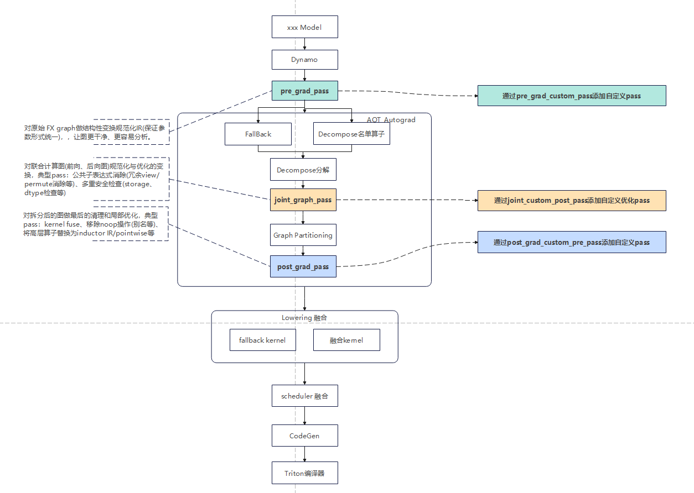

# 图优化特性介绍
## 图优化特性简介
在CANN（华为计算加速网络）异构计算架构中支持多种AI框架。该架构基于开源的PyTorch，并通过torch_npu适配昇腾AI处理器。torch_npu 利用 PyTorch 中的 Inductor 编译器能力，实现模型的加速编译。由于开源 PyTorch 对昇腾的适配性较弱，且对不同模型的图优化能力不足，需要通过自定义的优化 pass（优化步骤）来增强图优化能力，从而进一步提升模型性能。

当前pass主要应用在模型推理过程中，pre/post两个图优化阶段，包含pass如下所示
```
# pre
cat_slice_cat_fold_pass
pad_slice_fold
```

```
# post
fold_four_op_pass
fold_cast
fold_cat
fold_clone
fold_expand
fold_detach
fold_reduce
fold_sink_view
fold_slice
fold_squeeze
fold_to_copy
view_fold_pass
fold_where
fold_redundant_ops
dtype_optimal_pass
```

## 图优化特性使用示例

**前置条件**：
- 已在系统上安装 `torch_npu` 包（对应的版本需匹配所使用的 PyTorch 版本）。
- 机器配备 Ascend NPU 并已正确安装驱动和运行时环境。
- 确认 PyTorch 版本 >= 2.0，以支持 `torch.compile`。

```
import torch
from torch._dynamo.testing import rand_strided
import torch_npu


def op_calc(t1):
    inputPad = torch._C._nn.pad(t1, [0, 0, 0, 50], "constant", 0.0)
    inputSlice = inputPad[:50, :]
    output = torch.relu(inputSlice)
    return output


shapeA, strideA = (50, 100), (100, 1)
a = rand_strided(shapeA, strideA, device="npu", dtype=torch.float32)
with torch.no_grad():
    optimized = torch.compile(
        op_calc, backend="inductor", dynamic=False
    )  # 使用PyTorch编译模式，选择后端backend="inductor",编译时默认使能图优化pass
    compile_result = optimized(a)  # 获取运行结果
```

## 图优化特性应用效果
### 编译进行中
在编译执行的过程中，将inductor日志级别设置为DEBUG(export INDUCTOR_ASCEND_LOG_LEVEL=DEBUG)，出现如下打印即为pass生效：
```
# 设置 inductor 日志级别以便观察 pass 生效情况
import os
os.environ["INDUCTOR_ASCEND_LOG_LEVEL"] = "INFO"
import torch
```
```
# 编译器pass生效日志
DEBUG - Registering function cat_slice_cat_fold_pass from module torch_npu._inductor.fx_passes.ascend_custom_passes.ascend_graph_pass with pass_type=PassType.PRE, fx_pass_level=FxPassLevel.LEVEL1
DEBUG - Registering function pad_slice_fold from module torch_npu._inductor.fx_passes.ascend_custom_passes.ascend_graph_pass with pass_type=PassType.PRE, fx_pass_level=FxPassLevel.LEVEL1
DEBUG - Registering function fold_four_op_pass from module torch_npu._inductor.fx_passes.ascend_custom_passes.ascend_graph_pass with pass_type=PassType.POST, fx_pass_level=FxPassLevel.LEVEL1
DEBUG - Registering function fold_cast from module torch_npu._inductor.fx_passes.ascend_custom_passes.ascend_graph_pass with pass_type=PassType.POST, fx_pass_level=FxPassLevel.LEVEL1
DEBUG - Registering function fold_cat from module torch_npu._inductor.fx_passes.ascend_custom_passes.ascend_graph_pass with pass_type=PassType.POST, fx_pass_level=FxPassLevel.LEVEL1
DEBUG - Registering function fold_clone from module torch_npu._inductor.fx_passes.ascend_custom_passes.ascend_graph_pass with pass_type=PassType.POST, fx_pass_level=FxPassLevel.LEVEL1
DEBUG - Registering function fold_detach from module torch_npu._inductor.fx_passes.ascend_custom_passes.ascend_graph_pass with pass_type=PassType.POST, fx_pass_level=FxPassLevel.LEVEL1
DEBUG - Registering function fold_expand from module torch_npu._inductor.fx_passes.ascend_custom_passes.ascend_graph_pass with pass_type=PassType.POST, fx_pass_level=FxPassLevel.LEVEL1
DEBUG - Registering function fold_reduce from module torch_npu._inductor.fx_passes.ascend_custom_passes.ascend_graph_pass with pass_type=PassType.POST, fx_pass_level=FxPassLevel.LEVEL1
DEBUG - Registering function fold_sink_view from module torch_npu._inductor.fx_passes.ascend_custom_passes.ascend_graph_pass with pass_type=PassType.POST, fx_pass_level=FxPassLevel.LEVEL1
DEBUG - Registering function fold_slice from module torch_npu._inductor.fx_passes.ascend_custom_passes.ascend_graph_pass with pass_type=PassType.POST, fx_pass_level=FxPassLevel.LEVEL1
DEBUG - Registering function fold_squeeze from module torch_npu._inductor.fx_passes.ascend_custom_passes.ascend_graph_pass with pass_type=PassType.POST, fx_pass_level=FxPassLevel.LEVEL1
DEBUG - Registering function fold_to_copy from module torch_npu._inductor.fx_passes.ascend_custom_passes.ascend_graph_pass with pass_type=PassType.POST, fx_pass_level=FxPassLevel.LEVEL1
DEBUG - Registering function view_fold_pass from module torch_npu._inductor.fx_passes.ascend_custom_passes.ascend_graph_pass with pass_type=PassType.POST, fx_pass_level=FxPassLevel.LEVEL1
DEBUG - Registering function fold_where from module torch_npu._inductor.fx_passes.ascend_custom_passes.ascend_graph_pass with pass_type=PassType.POST, fx_pass_level=FxPassLevel.LEVEL1
DEBUG - Registering function fold_redundant_ops from module torch_npu._inductor.fx_passes.ascend_custom_passes.ascend_graph_pass with pass_type=PassType.POST, fx_pass_level=FxPassLevel.LEVEL1
DEBUG - Registering function dtype_optimal_pass from module torch_npu._inductor.fx_passes.ascend_custom_passes.ascend_graph_pass with pass_type=PassType.PRE, fx_pass_level=FxPassLevel.LEVEL1
```

### 运行结果
当前图优化特性提供了多个图优化pass，经过优化的图，以 pad_slice_fold pass为例， 在优化前和优化后的代码如下所示：
```
# 优化前
def op_calc(self, t1):
    inputPad = torch._C._nn.pad(t1, [0, 0, 0, 50], "constant", 0.0)
    inputSlice = inputPad[:50, :]
    output = torch.relu(inputSlice)
    return output
```
```
# 优化后
def op_calc(self, t1):
    inputSlice = t1[:50, :]
    output = torch.relu(inputSlice)
    return output
```