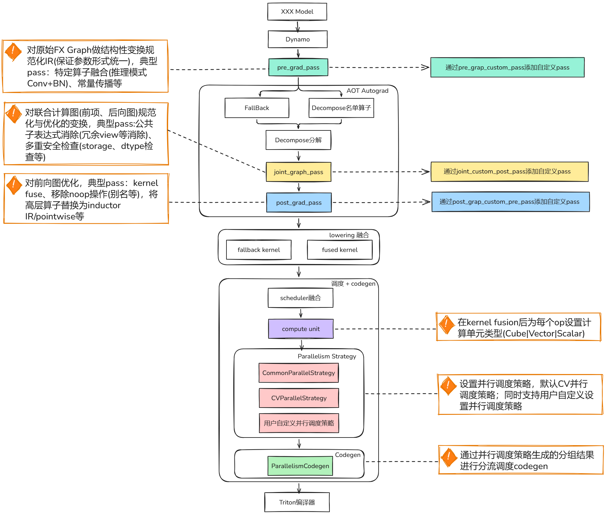

# parallel_schedule

## 功能描述

在原生torch Inductor compile流程中，计算图的执行被串行化到一个默认stream中完成，即使两个kernel在计算图中没有数据依赖，也会被强制串行执行，从而限制了设备多计算单元与异步引擎的并发能力，无法实现计算重叠，从而成为性能瓶；针对这个问题，面向A5 + Pytorch-v2.9.0，提出计算图并行调度下发算子能力，在开启图下沉时且完成Kernel Fusion后引入对计算图并行能力的计算，利用设备多计算单元与异步引擎的并发能力，实现推理加速；
基于多流的并发调度具体功能是在Inductor的调度体系中，在完成Kernel Fusion后引入对计算图并行能力的计算，主要功能：
1.利用收敛算法、CV分离并行策略将可并行且组间计算单元不同、组内计算单元相同的子图进行分流并行执行，最大化的利用昇腾设备架构CV并行计算能力，提高计算单元利用率；
2.支持用户根据业务场景灵活接入并行调度策略，而无需修改底层执行逻辑，提供简洁易用的配置与接入方式；


## 计算图多流并行调度配置示例

### 开启计算图多流并行调度

```shell
export ENABLE_PARALLEL_SCHEDULER=True
```

```shell

# 验证1.观察日志出现并行分组日志打印：

INFO - cv parallel group len: 3
INFO - Group CUBE (11 nodes): ['op2', 'op3', 'op4', 'op5', 'op6', 'op7', 'op8', 'op9', 'op10', 'op11', 'op12']
INFO - Group VECTOR (3 nodes): ['op25_op26_op27_op28_op29_op30_op31_op32_op33_op34_op35_op36_op37_op38_op39_op40_op41_op42_op43_op44_op45', 'op46_op47_op48_op49_op50_op51_op52_op53_op54_op55_op56_op57_op58_op59_op60_op61_op62_op63_op64_op65_op66', 'op67_op68_op69_op70_op71_op72_op73_op74']
INFO - Group MAIN (14 nodes): ['op0_op1', 'op13', 'op14_op15', 'op16_op17', 'op18_op19', 'op20_op21', 'op22_op23', 'op24', 'op75', 'op76', 'op77', 'op78', 'op79', 'op80']

```

```python
# 验证2.查看inductor编译产物：XXX/model__1_inference_3.0/output_code.py文件中出现stream、event的定义，例如：

def call(args):
    arg0_1, arg1_1, arg2_1, arg3_1, arg4_1, arg5_1, arg6_1, arg7_1, arg8_1, arg9_1, arg10_1, arg11_1, arg12_1, arg13_1, arg14_1, arg15_1, arg16_1, arg17_1, arg18_1, arg19_1, arg20_1, arg21_1, arg22_1, arg23_1, arg24_1, arg25_1, arg26_1, arg27_1, arg28_1, arg29_1, arg30_1 = args
    args.clear()
    buf1 = empty_strided((128, 6144), (6144, 1), device='npu', dtype=torch.float32)
    buf15 = empty_strided((128, 3072), (3072, 1), device='npu', dtype=torch.float32)
    buf16 = empty_strided((128, 3072), (3072, 1), device='npu', dtype=torch.float32)
    buf17 = empty_strided((128, 3072), (3072, 1), device='npu', dtype=torch.float32)
    buf19 = empty_strided((128, 1536), (1536, 1), device='npu', dtype=torch.float32)
    buf21 = empty_strided((128, 1536), (1536, 1), device='npu', dtype=torch.float32)
    buf23 = empty_strided((128, 1536), (1536, 1), device='npu', dtype=torch.float32)
    import torch_npu
    main_stream = torch_npu.npu.current_stream()
    main_event = torch_npu.npu.Event()
    main_event.record(main_stream)
    stream_group_cube = torch_npu.npu.Stream()
    event_group_cube = torch_npu.npu.Event()
    stream_group_vector = torch_npu.npu.Stream()
    event_group_vector = torch_npu.npu.Event()
    with torch.npu.utils.device(0):
        torch.npu.set_device(0)
        xxx.xxx1(c_void_p(arg1_1.data_ptr()), c_void_p(arg3_1.data_ptr()), c_void_p(arg4_1.data_ptr()), c_void_p(buf1.data_ptr()), 128, 6144, 1000, None, None, c_void_p(main_stream.npu_stream))
        del arg1_1
        del arg3_1
        del arg4_1
        buf2 = empty_strided((128, 6144), (6144, 1), device='npu', dtype=torch.float32)
        buf3 = empty_strided((128, 6144), (6144, 1), device='npu', dtype=torch.float32)
        buf4 = empty_strided((128, 6144), (6144, 1), device='npu', dtype=torch.float32)
        buf5 = empty_strided((128, 6144), (6144, 1), device='npu', dtype=torch.float32)
        buf6 = empty_strided((128, 6144), (6144, 1), device='npu', dtype=torch.float32)
        buf7 = empty_strided((128, 6144), (6144, 1), device='npu', dtype=torch.float32)
        buf8 = empty_strided((128, 6144), (6144, 1), device='npu', dtype=torch.float32)
        buf9 = empty_strided((128, 6144), (6144, 1), device='npu', dtype=torch.float32)
        buf10 = empty_strided((128, 6144), (6144, 1), device='npu', dtype=torch.float32)
        buf11 = empty_strided((128, 6144), (6144, 1), device='npu', dtype=torch.float32)
        buf12 = empty_strided((128, 3072), (3072, 1), device='npu', dtype=torch.float32)
        with torch_npu.npu.stream(stream_group_cube):
            stream_group_cube.wait_event(main_event)
            workspace_0 = empty_strided((14680064, ), (1, ), device='npu', dtype=torch.uint8)
            xxx.xxx1(c_void_p(buf1.data_ptr()), c_void_p(arg5_1.data_ptr()), c_void_p(buf2.data_ptr()), 128, 6144, 6144, None, c_void_p(workspace_0.data_ptr()), c_void_p(stream_group_cube.npu_stream))
            del arg5_1
            buf3 = buf2;     del buf2  # reuse
        # Topologically Sorted Source Nodes: [add, input_4], Original ATen: [aten.addmm, aten.relu]
            xxx3.run(buf3, arg6_1, 128, 6144, stream=stream_group_cube.npu_stream)

```

### 关闭计算图多流并行调度(默认关闭)

```shell
export ENABLE_PARALLEL_SCHEDULER=False
```

```shell

# 验证
# 1.观察日志未出现并行分组日志打印
# 2.查看inductor编译产物：XXX/model__1_inference_3.0/output_code.py文件中未出现stream、event的定义

```

## 用户添加自定义并行调度策略配置示例

### 开启计算图多流并行调度

```shell
export ENABLE_PARALLEL_SCHEDULER=True
```

### 编写自定义并行调度策略代码

```python
# 创建自定义调度策略类继承并行策略基类ParallelStrategyBase，实现assign_parallel_groups函数

from typing import List, Dict, Set

import torch
from torch._inductor.scheduler import BaseSchedulerNode
from .parallelism_strategy_base import ParallelStrategyBase


class CustomParallelStrategy(ParallelStrategyBase):

    def assign_parallel_groups(self, nodes: List[BaseSchedulerNode]) -> Dict[str, List[BaseSchedulerNode]]:
        final_groups = dict()
        # 编写自定义的并行分组调度策略代码
        return final_groups

```

### 注册自定义并行调度策略

```python
# 在torch_npu\_inductor\__init__.py文件中计算图多流并行调度入口处添加注册代码
    if os.environ.get("ENABLE_PARALLEL_SCHEDULER", "false").lower() == "true":
        from .fx_passes.parallel_scheduler_pass import parallel_scheduler

        # 添加自定义调度策略注册代码 begin
        from .fx_passes.parallelism_strategy_custom import CustomParallelStrategy
        from .fx_passes.parallelism_strategy_framework import register_custom_parallel_strategy
        register_custom_parallel_strategy("custom", CustomParallelStrategy)
        # 添加自定义调度策略注册代码 end

        parallel_scheduler()

```

## 使用约束

计算图多流并行调度特性默认关闭，需要在图下沉开启时使用计算图多流调度能力，当前仅适用于模型推理过程。

## 支持的型号

- <term>Atlas A5 系列产品</term>
