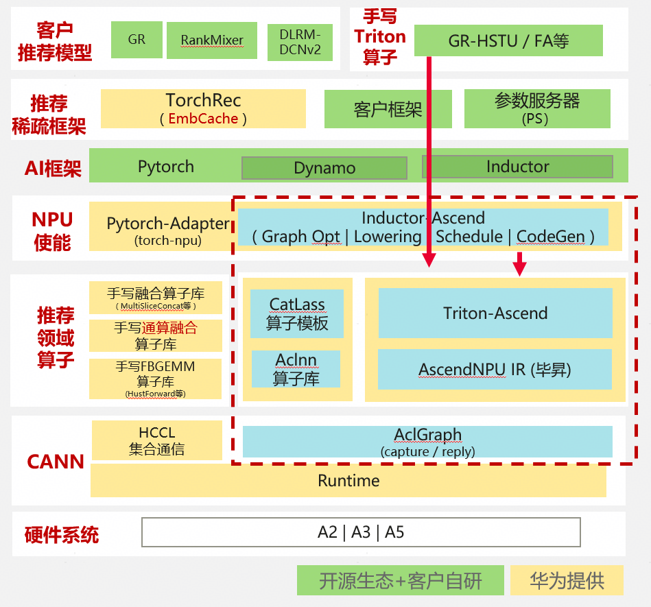
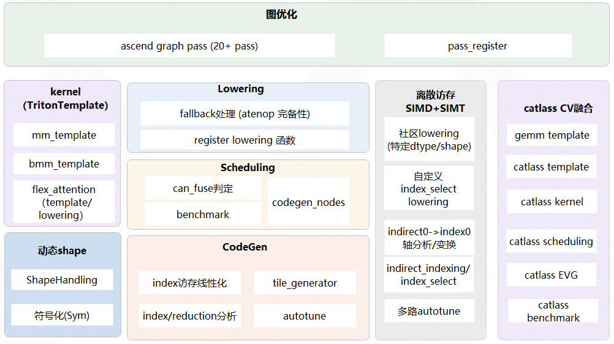

# 概述
## 简介
Inductor-Ascend在继承Pytorch社区Inductor能力的基础上，针对昇腾Ascend硬件，进行了亲和性改进和优化。其目标是：提供昇腾亲和的torch.compile图模式后端；生成昇腾亲和的Triton DSL，支持基于triton的算子自动融合；支持动态shape。

如图1（推荐场景-图模式-软件栈）所示，Inductor-Ascend和社区Inductor的执行流程类似，其内嵌于PyTorch-Adapter（torch-npu）中，当用户开启图模式后端torch.compile(backend="inductor")时，Inductor-Ascend承接Dynamo抓取的FX Graph，进行编译、融合，生成昇腾亲和融合算子Triton DSL；最后由Triton-Ascend、AscendNPU-IR编译优化，生成昇腾指令机器码（二进制）。

和社区类似，对于无法参与融合的算子（AtenOp），Inductor-Ascend会将其作fallback处理，即fallback到ACLNN算子、手写算子等。

图1 推荐场景-图模式-软件栈

  

当前Inductor-Ascend逻辑组件如图2所示，其核心组件是：图优化、lowering、scheduling、CodeGen。此外，针对A5 SIMT，Inductor支持了基于SIMD+SIMT的离散访存类算子融合；引入Catlass算子模板库支持mm/bmm/addmm/groupmm及其与ReLU等pointwise/broadcast类算子融合；支持flex attention；支持动态Shape等。(相关常用概念见下表)

图2 Inductor-Ascend逻辑架构图

  

## 使用约束
-   <term>Atlas A5 系列产品</term>

## 常用概念

| 名称 | 说明                                                                                                                                                                                                                                          |
|---|---------------------------------------------------------------------------------------------------------------------------------------------------------------------------------------------------------------------------------------------|
| Eager模式 | PyTorch支持的单算子执行模式（未使用torch.compile），特点如下，单击[Link](https://pytorch.org/blog/optimizing-production-pytorch-performance-with-graph-transformations/)可获取PyTorch官网介绍。具有两个特点：（a） 即时执行：每个计算操作在定义后立即执行，无需构建计算图。（b） 动态计算图：每次运行生成计算图。                 |
| 图模式 | 一般指使用torch.compile加速的模型执行方式。                                                                                                                                                                                                                |
| ATen | 全称为A Tensor Library，是PyTorch张量计算的底层核心函数库，这些函数通常称为ATen算子，负责所有张量操作（如加减乘除、矩阵运算等）。详细介绍可单击[Link](https://github.com/pytorch/pytorch/tree/main/aten/src/ATen)获取PyTorch官网详情                                                                        |
| FX Graph | Functionality Graph，是PyTorch中用于表示模型计算流程的中间层数据结构。通过符号化追踪代码生成计算图，将Python代码转为中间表示（IR，Intermediate Representation），实现计算图的动态调整和优化（如量化、剪枝等），详细介绍可单击[Link](https://docs.pytorch.org/docs/stable/fx.html)获取torch.fx详情。                              |
| Triton-Ascend | 面向昇腾平台构建的Triton编译框架，旨在让Triton代码能够在昇腾硬件上高效运行。详细介绍可点击 [Link](https://gitcode.com/Ascend/triton-ascend)获取详情                                                                                                                                    |
| AscendNPU-IR | AscendNPU IR（AscendNPU Intermediate Representation）是基于MLIR（Multi-Level Intermediate Representation）构建的，面向昇腾亲和算子编译时使用的中间表示，提供昇腾完备表达能力，通过编译优化提升昇腾AI处理器计算效率，支持通过生态框架使能昇腾AI处理器与深度调优。详细介绍可点击 [Link](https://gitcode.com/Ascend/AscendNPU-IR)获取详情 |
| Catlass | CATLASS(CANN Templates for Linear Algebra Subroutines)，中文名为昇腾算子模板库，是一个聚焦于提供高性能矩阵乘类算子基础模板的代码库。详细介绍可点击 [Link](https://gitcode.com/cann/catlass)获取详情
| 图优化 | Inductor核心组件之一，其主要作用是：对FX Graph进行优化，例如：消除冗余节点、等价替换、常量展开等
| Lowering | Inductor核心组件之一，其作用是：从上层FX Graph一步步转换、规范化、下城到Inductor的低层IR，为后续融合和Triton代码铺路
| Scheduling | Inductor核心组件之一，其作用是：对Inductor IR进行融合(水平融合、垂直融合)
| CodeGen | Inductor核心组件之一，其作用是：生成融合算子的代码，Triton Kernel代码(NPU)、C++/OpenMP代码(CPU)
| SIMT | Single Instruction, Multiple Threads，详细介绍可点击[link](https://www.glick.cloud/blog/simt-vs-simd-parallelism-in-modern-processors) 
| SIMD | Single Instruction Multiple Data，详细介绍可点击[link1](https://www.glick.cloud/blog/simt-vs-simd-parallelism-in-modern-processors) [link2](https://docs.nvidia.com/cuda/cuda-programming-guide/02-basics/writing-cuda-kernels.html)
| FlexAttention | FlexAttentin是Pytorch-2.5+推出的灵活、高性能注意力编程模型，核心是：用几行Pytorch代码自定义任意注意力变体，同时获得极致性能，详细介绍可点击[link1](https://pytorch.org/blog/flexattention/) [link2](https://arxiv.org/abs/2412.05496)
| 动态Shape | 是指算子输入Tensor的shape不固定，一般常见于变化的BatchSize和SeqLen。详细介绍可点击[link1](https://ianbarber.blog/2025/04/04/dynamic-shapes-in-pytorch/) [link2](http://docs.pytorch.org/docs/main/user_guide/torch_compiler/torch.compiler_dynamic_shapes.html)

## 使用说明
首次阅读本文档时，建议先阅读下表，以帮助您快速获取Inductor-Ascend安装方法、快速上手示例、特性与调优配置、性能分析与优化等。

| 使用场景 | 操作索引                                                                            |
| ------ |---------------------------------------------------------------------------------|
| 1. 环境准备与安装 | [安装](../installation/installation.md)                                           |
| 2. 快速开始| [开始](../getting_started/getting_started.md)                                     |
| 3. torch.compile API 详解 | [torch.compile API](../torch_compile_api/torch_compile_api.md)                  |
| 4. 特性与调优配置 | [特性/调优](../feature)                                                             |
| 5. 性能分析与优化 | [性能分析/优化](../profiling/profiling_performance.md) |
| 6. 故障排查与反馈 | [故障排查/反馈](../troubleshooting/reporting_issues.md)                                                                  |